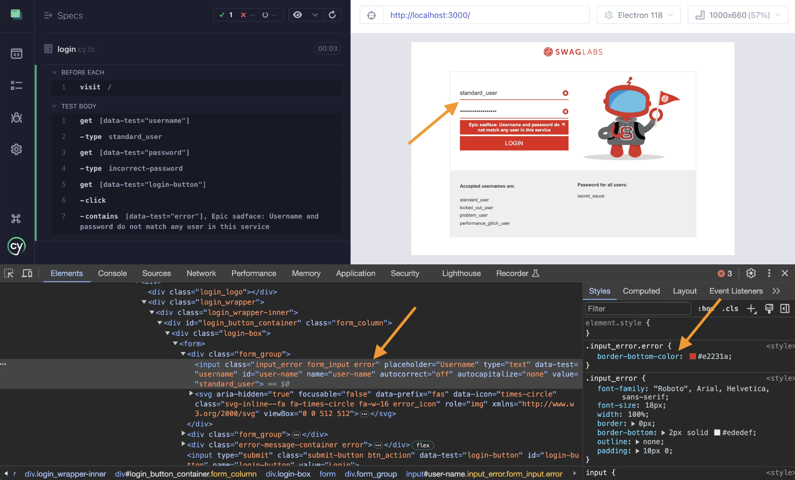

## ☀️ Functional Testing For Styles

### 📚 You will learn

- Asserting styles
- Declared vs computed styles
- Modifying styles from the test

---

## Confirm the error styles

Using branch `a2` as the starting point

```
$ git checkout a2
$ npm install
```

**Tip:** to remove your old work, use `git reset --hard`

+++


+++

## Finish this test

```js
it('wrong password', () => {
  cy.get(selectors.username).type(user.username)
  cy.get(selectors.password).type('incorrect-password')
  cy.get(selectors.loginButton).click()
  // confirm the page shows errors and stays on login URL
  // https://on.cypress.io/contains
  cy.contains(
    selectors.error,
    'Epic sadface: Username and password do not match any user in this service',
  )
  cy.location('pathname').should('equal', '/')
  // confirm the error message is red
  // (the background color is rgb(226, 35, 26))
  // confirm the username input has the error class
  // tip: look up using computed style in the browser
  // https://glebbahmutov.com/cypress-examples/recipes/computed-style.html
})
```

**Tip:** read https://glebbahmutov.com/cypress-examples/recipes/computed-style.html

+++


+++

## Finished test

```js
cy.location('pathname').should('equal', '/')
// confirm the error message is red
// (the background color is rgb(226, 35, 26))
const redColor = 'rgb(226, 35, 26)'
cy.get('.error-message-container')
  .then(($el) => window.getComputedStyle($el[0]).backgroundColor)
  .should('equal', redColor)
// confirm the username input has the error class
cy.get(selectors.username)
  .should('have.class', 'error')
  // and the red bottom border line
  .then(($el) => window.getComputedStyle($el[0]).borderBottomColor)
  .should('equal', redColor)
```

---

## Change element's style

Using branch `a3` as the starting point

```
$ git checkout a3
$ npm install
```

**Tip:** to remove your old work, use `git reset --hard`

+++

## Finish the test

```js
// confirm the error message is red
// (the background color is rgb(226, 35, 26))
const redColor = 'rgb(226, 35, 26)'
cy.get('.error-message-container')
  .then(($el) => window.getComputedStyle($el[0]).backgroundColor)
  .should('equal', redColor)
// from the test change the background color of the error element
// to green color and confirm the computed style is green
// Tip: all Cypress query commands yield a jQuery object
```

**Tip:** there is [$.css](https://learn.jquery.com/using-jquery-core/css-styling-dimensions/) method.

+++

## Finished test

```js
cy.get('.error-message-container').invoke('css', 'background-color', 'green')
cy.get('.error-message-container')
  .then(($el) => window.getComputedStyle($el[0]).backgroundColor)
  .should('equal', 'rgb(0, 128, 0)')
```

+++


---

## Remove CSS class from an element

Using branch `a4` as the starting point

```
$ git checkout a4
$ npm install
```

**Tip:** to remove your old work, use `git reset --hard`

+++



+++

The input element shows the red border on the bottom. Where is this style coming from? I think it is set by the CSS "error" class. Let's confirm it by removing the "error" class from the input element and checking the computed style.

Todo: Modify the `login.cy.ts` spec following the comments.

+++

## Solution

```js
// remove the error class from the username input
cy.get(selectors.username).invoke('removeClass', 'error')
// confirm the border-bottom-color is back to the default
// #ededef = rgb(237, 237, 239)
cy.get(selectors.username)
  .then(($el) => window.getComputedStyle($el[0]).borderBottomColor)
  .should('equal', 'rgb(237, 237, 239)')
```

---

## 🏁 Conclusions

- checking element's color
- changing element's color
- changing element's classes

➡️ Pick the [next section](https://github.com/bahmutov/cypress-visual-testing-workshop#contents) or jump to the [01-waiting](?p=01-waiting) chapter
