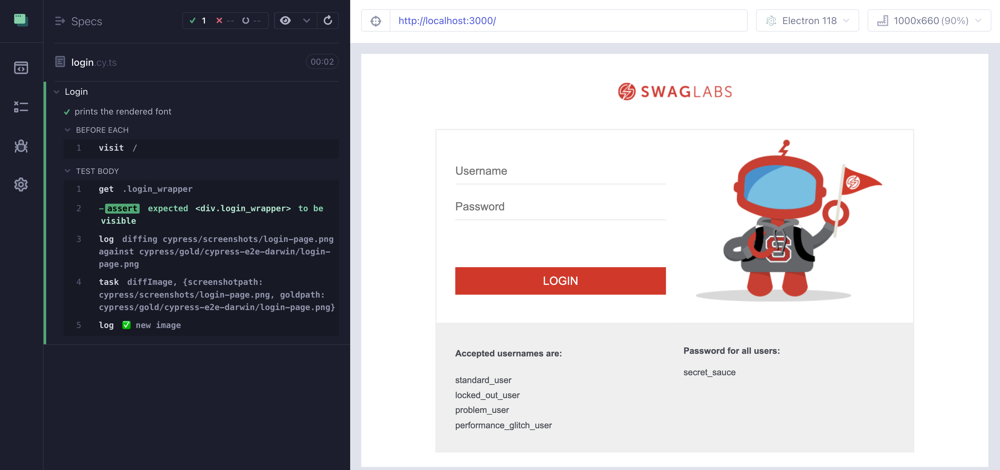
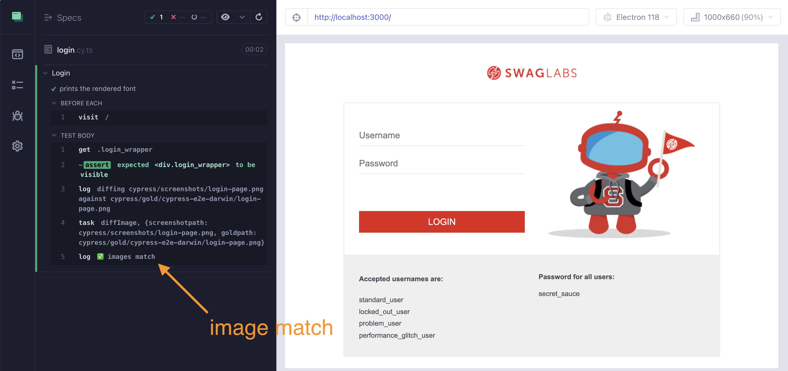
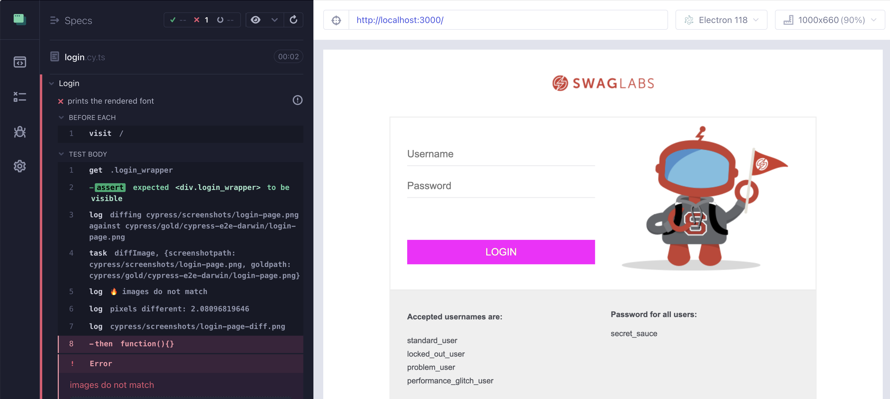
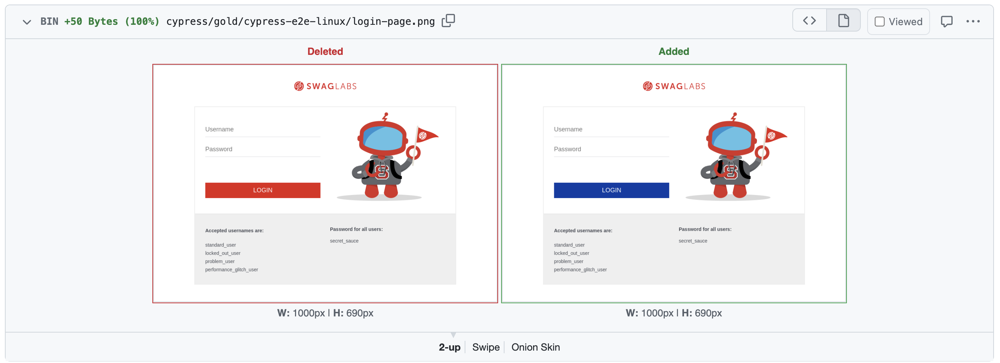
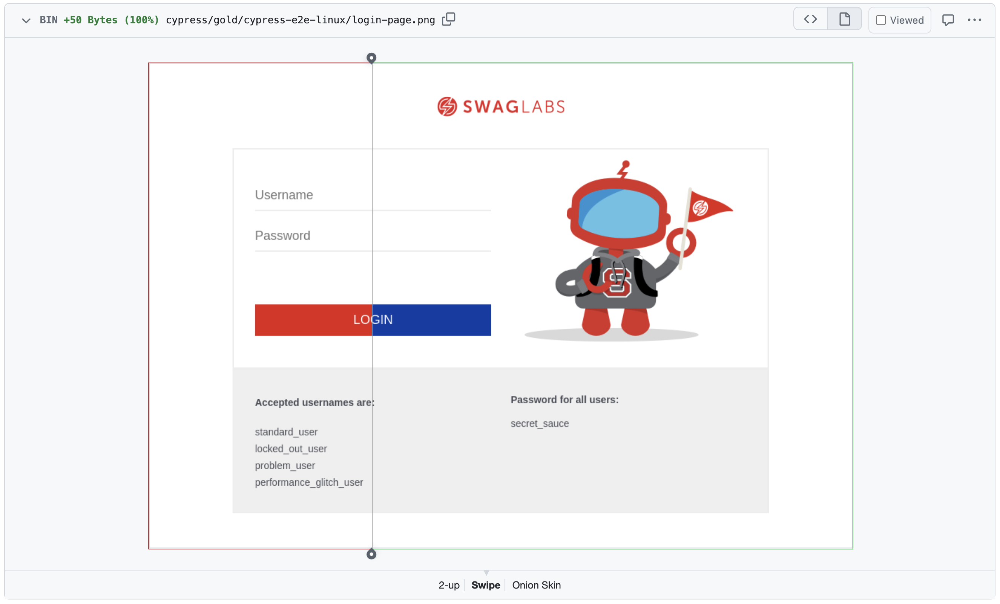

## ☀️ CI Workflow

### 📚 You will learn

- `cy.imageDiff` custom command
- Update gold images on CI workflows

---

## Custom image diff command

Using branch `c2` as the starting point

```
$ git checkout c2
$ npm install
```

I have added a custom Cypress command `cy.imageDiff`

+++

## The goal

Use the new `cy.imageDiff` command to finish the test.

```ts
// cypress/e2e/login.cy.ts
it('captures the login page', () => {
  // confirm the login form is visible
  // run the custom command "cy.imageDiff"
  // to compare the current page to the gold image
  // Tip: find the custom command TS definition in cypress/support/index.d.ts
  // and the implementation in cypress/support/commands.ts
})
```

**Tip:** try changing CSS in `src/components/SubmitButton.css` to check.

+++

## The solution

```ts
it('captures the login page', () => {
  cy.get('.login_wrapper').should('be.visible')
  cy.imageDiff('login-page')
})
```

There could **3** image diff results.

+++

## Result 1: A new image



+++

## Result 2: A matching image



+++

## Result 3: An image difference



+++

## Assertions

As a rule of 👍:

- a functional assertion first
- followed by a visual diff command

---

## GitHub Actions Workflows

Let's review changed images on CI

```
$ git checkout c4
$ npm install
```

+++

## Make changed screenshot a new gold 🖼️

```js
// cypress.config.cjs

// if we work on a PR we want to update the Gold images
// so that the user reviews the changes
if (result.match === false && config.env.updateGoldImages) {
  console.log('Updating gold image %s', goldPath)
  fs.copyFileSync(screenshotPath, goldPath)
  result.match = true
  result.reason = 'Updated gold image'
}
```

+++

## Workflow

Set the Cypress env flag `updateGoldImages=true`

```yml
# .github/workflows/ci.yml
- name: E2E 📦
  uses: cypress-io/github-action@v6
  with:
    start: npm start
    wait-on: 'http://127.0.0.1:3000'
    # tell our image diff utility that even if the screenshot
    # differs from the gold image, we want to update the gold image
    # so that the user reviews the change in the PR
```

**Tip:** see how to pass user `env` values https://on.cypress.io/environment-variables

+++

## Solution

```yml
- name: E2E 📦
  uses: cypress-io/github-action@v6
  with:
    start: npm start
    wait-on: 'http://127.0.0.1:3000'
    # tell our image diff utility that even if the screenshot
    # differs from the gold image, we want to update the gold image
    # so that the user reviews the change in the PR
    env: updateGoldImages=true
```

+++

## Workflow in action

- make a new branch based on `c4`, like `c4-demo`
- push the branch to GitHub to see the gold images
- make a new branch and change some CSS
- push the code and open a PR to `c4-demo`
- see the changed gold images in the PR

+++

## New gold images committed by CI


+++

## Before and after images



+++

## Swipe viewer



---

## Even better CI workflows

In branch `c5` we have two `env` options:

- `failOnMissingGoldImage=true` _requires_ a gold image
- `updateGoldImages=true` overwrites the gold images

Get the code:

```
$ git checkout c5
$ npm install
```

+++

## Two workflows

- the `main` branch is strict: must have gold images, no diffs allowed
  - file `.github/workflows/main.yml`
- other branches allow overwriting gold images with screenshots
  - file `.github/workflows/ci.yml`

+++

## Login spec

- you need to add 3 image diffs to the Login spec
- where would you place the image diffs?

+++

## Login spec solution

```js
it('buys an item', () => {
  cy.visit('/')
  cy.get('.login_wrapper').should('be.visible')
  cy.get(selectors.username).type('standard_user')
  cy.get(selectors.password).type('secret_sauce')

  cy.imageDiff('login') // one

  cy.get(selectors.loginButton).click()
  cy.location('pathname').should('equal', '/inventory')
  cy.get('.inventory_container').should('be.visible')
  cy.contains('button', 'Add to cart').click()
  cy.contains('.shopping_cart_badge', 1).should('be.visible')

  cy.imageDiff('inventory') // two

  cy.get('a.shopping_cart_link').click()
  cy.location('pathname').should('equal', '/cart')
  cy.get('.cart_list').should('be.visible')

  cy.imageDiff('cart') // three

  cy.contains('button', 'Checkout').click()
  cy.location('pathname').should('equal', '/checkout-step-one')
  cy.get(checkoutSelectors.firstName).type('John')
  cy.get(checkoutSelectors.lastName).type('Doe')
  cy.get(checkoutSelectors.postalCode).type('90210')
  cy.get(checkoutSelectors.continueButton).click()
  cy.location('pathname').should('equal', '/checkout-step-two')
  cy.get('.checkout_summary_container').should('be.visible')
  cy.contains('button', 'Finish').click()
  cy.location('pathname').should('equal', '/checkout-complete')
  cy.get('.checkout_complete_container').should('be.visible')
})
```

3 visual assertions at 3 major steps of the user flow.

+++

## See it in action on CI

- create a new branch `c5-demo` and push it to CI
  - it should create gold images
- create another branch and change some CSS
  - push to GitHub and open a PR to `c5-demo`
  - did CI catch the visual regression?

---

## 🏁 Conclusions

- `cy.imageDiff` custom command
- CI can commit changed images on PR
- GitHub PR review shows image differences clearly

➡️ Pick the [next section](https://github.com/bahmutov/cypress-visual-testing-workshop#contents) or jump to the [08-data](?p=08-data)
