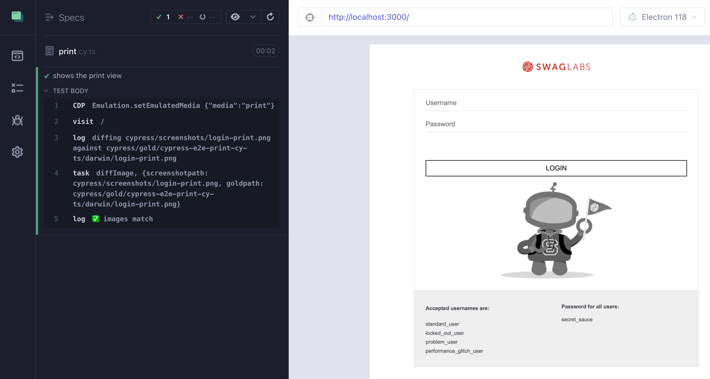
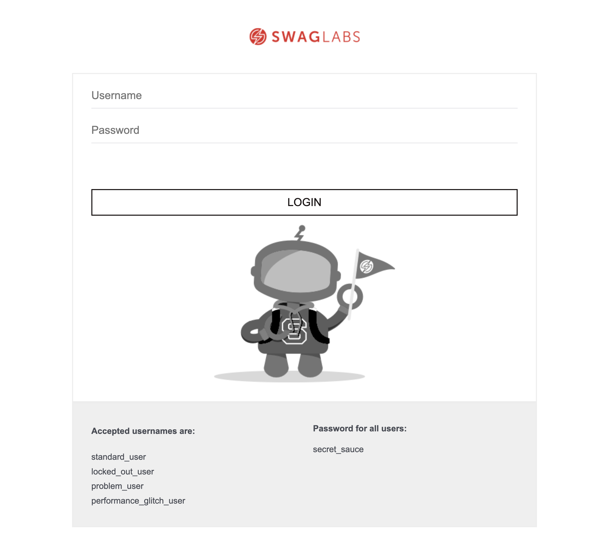
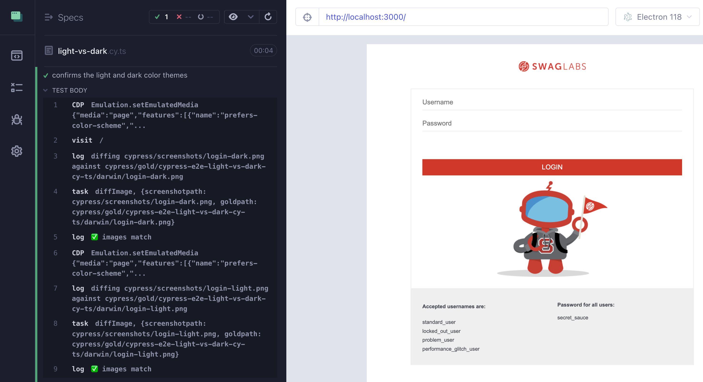
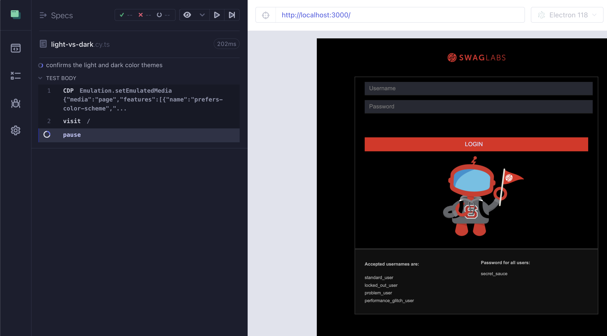

## ☀️ Print media and dark color scheme

### 📚 You will learn

- how to test print media CSS
- setting dark or light color theme preferences

---

## Testing the print media

Using branch `d1` as the starting point

```
$ git checkout d1
$ npm install
```

+++

## Print media CSS

```css
.bot_column {
  float: none;
  width: 100%;
  height: 100%;
  background: url('/assets/img/Login_Bot_graphic.png') no-repeat center center;
  min-height: 260px;
  min-width: 300px;
}
@media print {
  .bot_column {
    background: url('../img/Login_Bot_graphic_bw.png') no-repeat center center;
  }
}
```

+++

## The spec

```js
it('shows the print view', () => {
  // we want to confirm the application login page
  // looks good when printed
  // Tip: you can use cy.CDP to emulate the print media
  // https://github.com/bahmutov/cypress-cdp
  // https://chromedevtools.github.io/devtools-protocol/tot/Emulation/
  cy.visit('/')
  // confirm how the login page looks by taking an image diff
  // cy.imageDiff('login-print')
})
```

**Tip:** use https://github.com/bahmutov/cypress-cdp

+++

## The solution

```js
it('shows the print view', () => {
  cy.CDP('Emulation.setEmulatedMedia', {
    media: 'print',
  })
  cy.visit('/')
  cy.imageDiff('login-print')
})
```

+++

## The app



+++

## The gold image



---

## Testing light and dark color schemes

```
$ git checkout d2
$ npm install
```

+++

## Additional dark color scheme

```css
input {
  -webkit-appearance: none;
  -moz-appearance: none;
  appearance: none;
  border-radius: 0;
  color: #484c55;
}
/* dark color theme */
@media (prefers-color-scheme: dark) {
  input {
    background-color: #262933;
    color: #daddfe !important;
    padding-left: 1rem !important;
  }
}
```

+++

## The spec

```js
it('confirms the light and dark color themes', () => {
  // emulate the dark page color scheme
  // https://github.com/bahmutov/cypress-cdp
  // https://chromedevtools.github.io/devtools-protocol/tot/Emulation/
  // Tip: read the blog post "Emulate Media In Cypress Tests"
  // https://glebbahmutov.com/blog/cypress-emulate-media/
  //
  cy.visit('/')
  // prevent CSS regressions by taking an image diff
  // cy.imageDiff('login-dark')
  // switch back to the light color scheme
  //
  // and take another image diff
  // cy.imageDiff('login-light')
})
```

**Tip:** use https://github.com/bahmutov/cypress-cdp and read https://glebbahmutov.com/blog/cypress-emulate-media/

+++

## The solution

```js
it('confirms the light and dark color themes', () => {
  cy.CDP('Emulation.setEmulatedMedia', {
    media: 'page',
    features: [
      {
        name: 'prefers-color-scheme',
        value: 'dark',
      },
    ],
  })
  cy.visit('/')
  cy.imageDiff('login-dark')
  // switch back to the light color scheme
  cy.CDP('Emulation.setEmulatedMedia', {
    media: 'page',
    features: [
      {
        name: 'prefers-color-scheme',
        value: 'light',
      },
    ],
  })
  cy.imageDiff('login-light')
})
```

+++



+++



---

## 🏁 Conclusions

- You can emulate print media or color scheme using https://github.com/bahmutov/cypress-cdp and CDP

➡️ Pick the [next section](https://github.com/bahmutov/cypress-visual-testing-workshop#contents) or jump to the [10-random-robot](?p=10-random-robot)
