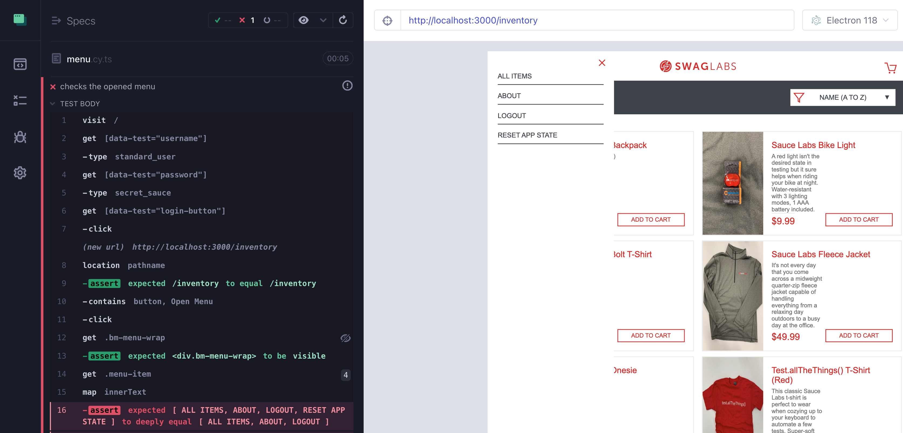

## ☀️ Element Diff

### 📚 You will learn

- how to diff just a single element
- function and visual assertion

---

## Open menu spec

Using branch `d9` as the starting point

```
$ git checkout d9
$ npm install
```

+++

## The menu column


+++

## Element diff

```js
// diff the entire page
cy.imageDiff('login')
// diff the footer
cy.get('footer').imageDiff('footer')
```

+++

## The login spec

```js
// cypress/e2e/login.cy.ts

it('diffs an element', () => {
  cy.visit('/')
  // test diff the element with class "login_credentials_wrap-inner"
  // but first confirm it is visible and includes the text
  // "Accepted usernames are:"
  // Use name "credentials" for the diff image
  //
  // Hint: cy.imageDiff is a dual command
  // https://on.cypress.io/custom-commands
})
```

+++

## The Login spec solution

```js
it('diffs an element', () => {
  cy.visit('/')
  cy.get('.login_credentials_wrap-inner') // function (existence)
    .should('be.visible') // functional
    .and('include.text', 'Accepted usernames are:') // functional
    .imageDiff('credentials') // visual
})
```

+++


---

## The menu spec

```js
it('checks the opened menu', () => {
  cy.visit('/')
  cy.get('[data-test="username"]').type('standard_user')
  cy.get('[data-test="password"]').type('secret_sauce')
  cy.get('[data-test="login-button"]').click()
  cy.location('pathname').should('eq', '/inventory')

  // open the menu by clicking on the button
  cy.contains('button', 'Open Menu').click()
  // confirm the menu element (the wrap column)
  // is visible and its children are the expected menu items
  // Hint: you can map the elements to their text content
  // using cy.map('innerText') from cypress-map plugin
  // https://github.com/bahmutov/cypress-map
  // and then use "deep.equal" assertion to check the array of strings
  const menuItems = ['ALL ITEMS', 'ABOUT', 'LOGOUT', 'RESET APP STATE']
  // take a screenshot of the menu column and image diff it as "menu"
})
```

+++

## The menu spec solution

```js
it('checks the opened menu', () => {
  cy.visit('/')
  cy.get('[data-test="username"]').type('standard_user')
  cy.get('[data-test="password"]').type('secret_sauce')
  cy.get('[data-test="login-button"]').click()
  cy.location('pathname').should('eq', '/inventory')

  cy.contains('button', 'Open Menu').click()
  const menuItems = ['ALL ITEMS', 'ABOUT', 'LOGOUT', 'RESET APP STATE']
  cy.get('.bm-menu-wrap')
    .should('be.visible') // functional
    .get('.menu-item')
    .map('innerText')
    .should('deep.equal', menuItems) // functional
  // take a screenshot of the menu column and image diff it as "menu"
  cy.get('.bm-menu-wrap').imageDiff('menu') // visual
})
```

+++


---

## Why use a functional assertion



+++

## Functional vs Visual

- `expected "Hello" to equal "Bye"`

### vs.

- `images do not match. Pixel difference 0.04%`

---

## 🏁 Conclusions

- you can use single element diffs to focus on a single component
- functional assertions for important information
- visual assertions for wide CSS coverage

➡️ Pick the [next section](https://github.com/bahmutov/cypress-visual-testing-workshop#contents)
