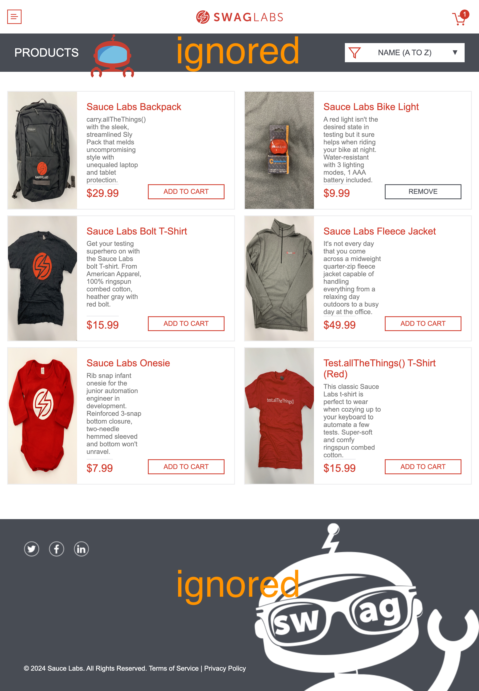

## ☀️ Visual Tests First

### 📚 You will learn

- where to add first visual assertions
- how to run the visual tests first

---

## Lots of specs

Using branch `e1` as the starting point

```
$ git checkout e1
$ npm install
```

There are 30 specs.

+++

## Q: Where to add the first visual assertions?

+++

## Add items to cart

**TODO:** add several visual assertions to the spec `cypress/e2e/cart/add-to-cart.cy.ts`

Questions to consider:

- full page diff?
- anything to ignore?

+++

## Visual assertions

```js
// cypress/e2e/cart/add-to-cart.cy.ts

InventoryPage.getCartBadge()
  .should('have.text', 1)
  .scrollIntoView()
  .should('be.visible')

cy.imageDiff('1-one-item-in-cart', {
  mode: 'sync',
  ignoreElements: ['.header_secondary_container', 'footer'],
})
```

The first visual assertion

+++

## Visual assertions

```js
cy.get('.inventory_item:contains("Remove")').should('have.length', 2)

cy.imageDiff('2-two-items-in-cart', {
  mode: 'sync',
  ignoreElements: ['.header_secondary_container', 'footer'],
})
```

The second visual assertion

+++

## Ignored elements



---

## Run visual tests first

Let's use test tags implemented in the plugin https://github.com/bahmutov/cy-grep

```
$ git checkout e2
$ npm install
```

**Important:** run the `npm install` command to install the plugin. The plugin is already configured in the project.

+++

## Add test tags to the spec

Mark the test in the spec `cypress/e2e/cart/add-to-cart.cy.ts` with tag `@visual`

+++

## Solution

```js
it(
	'adds items to the cart',
	{ viewportHeight: 1200, tags: '@visual' },
	() => {
    ...
  })
```

+++

## Run just the visual test

From the command line pass the grep test tag `@visual`

**Tip:** read the plugin documentation https://github.com/bahmutov/cy-grep

+++

```
$ CYPRESS_grepTags=@visual npm run ci
...
cy-grep: filtering using tag(s) "@visual"
cy-grep: will omit filtered tests
...

  (Run Starting)

  ┌───────────────────────────────────────────────────────────────────┐
  │ Cypress:        13.8.1                                            │
  │ Browser:        Electron 118 (headless)                           │
  │ Node Version:   v20.11.1 (/node/v20.11.1/bin/node)                │
  │ Specs:          1 found (add-to-cart.cy.ts)                       │
  │ Searched:       cypress/e2e/cart/add-to-cart.cy.ts                │
  │ Experiments:    experimentalRunAllSpecs=true                      │
  └───────────────────────────────────────────────────────────────────┘
```

+++

## Filter on CI

- run the `@visual` tests first
- then run the rest of the tests
- update the workflow file `.github/workflows/ci.yml`

+++

## Workflow file

```yml
# https://github.com/cypress-io/github-action
- name: Visual Cypress tests 🧪
  uses: cypress-io/github-action@v6
  with:
    start: npm start
    wait-on: 'http://127.0.0.1:3000'
    env: grepTags=@visual

# https://github.com/cypress-io/github-action
- name: All Cypress tests 🧪
  uses: cypress-io/github-action@v6
  # notice the "e2e" identifier for this tep
  # later steps can refer to the outputs of this steps
  # as "steps.e2e.outputs.visual_status" and "steps.e2e.outputs.visual_description
  id: e2e
  with:
    # do not install the dependencies again
    # and no need to start the server again
    install: false
```

---

## 🏁 Conclusions

- add visual assertions to the important user flows first
- ignore elements that are likely to change unrelated to the test
- use `@bahmutov/cy-grep` to add test tags and run visual tests first

➡️ Pick the [next section](https://github.com/bahmutov/cypress-visual-testing-workshop#contents) or jump to the [end](?p=end)
