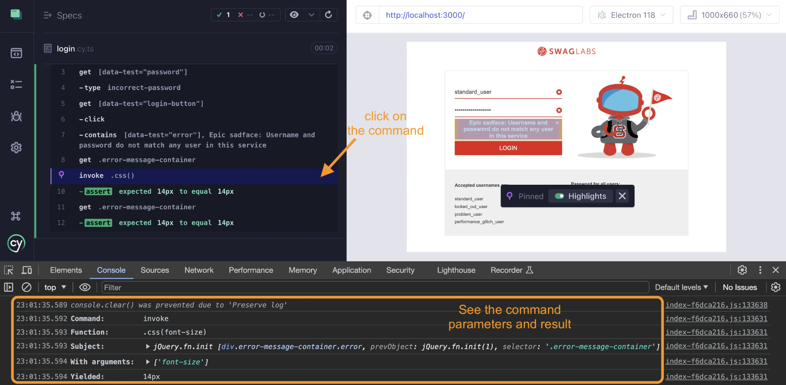
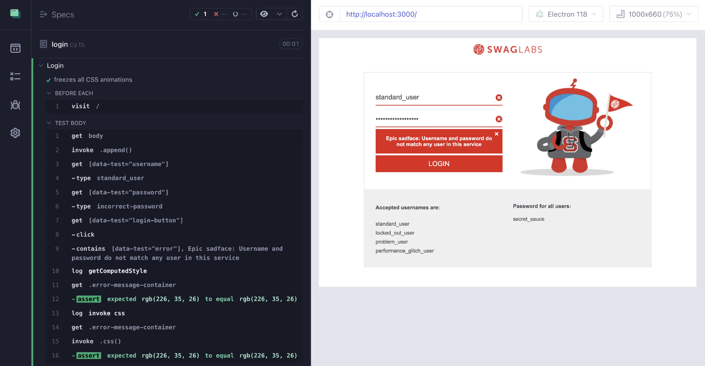
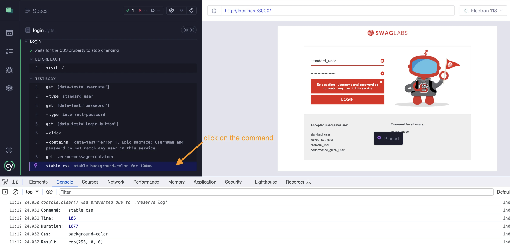

## ☀️ Waiting For Styles

### 📚 You will learn

- CSS animations
- Freezing and removing animations
- Waiting for stable CSS values

---

## Get computed style using $.css

Using branch `a5` as the starting point

```
$ git checkout a5
$ npm install
```

**Tip:** to remove your old work, use `git reset --hard`

+++

**Tip:** Avoid using `cy.then(callback)` to get styles. Instead use `$.css` on the current jQuery subject

```js
// instead of this 👎
cy.get(selector).then(($el) => {
  return window.getComputedStyle($el[0]).style
})
// prefer using this 👍
cy.get(selector).invoke('css', style)
```

+++

## Finish the test

```js
it('gets the computed style using $.css', () => {
  // get the error message container
  // and assert that it has the correct font-size
  // Tip: you can invoke the 'css' method to get the computed style
  // https://on.cypress.io/invoke
  // https://api.jquery.com/css/
  // does it yield a value as written in the CSS file ErrorMessage.css?
  // confirm the same value is returned by the window.getComputedStyle
})
```

+++

## The solution

```js
cy.get('.error-message-container')
  .invoke('css', 'font-size')
  .should('equal', '14px')
// confirm the same value is returned by the window.getComputedStyle
cy.get('.error-message-container')
  .then(($el) => {
    return window.getComputedStyle($el[0]).fontSize
  })
  .should('equal', '14px')
```

+++



Debugging `cy.invoke` command

---

## CSS Animation

Using branch `a6` as the starting point

```
$ git checkout a6
$ npm install
```

**Tip:** to remove your old work, use `git reset --hard`

+++

## The error message CSS

```css
@keyframes error {
  0% {
    background-color: #ffffff;
  }
  50% {
    background-color: #ff0000;
  }
  100% {
    background-color: #e2231a;
  }
}

.error-message-container.error {
  background-color: #e2231a;
  animation: error 3.5s;
}
```

+++

## Get The Final Style

Try getting the background color using each of these methods:

- using `window.getComputedStyle` inside `cy.then(callback)`
- using `cy.invoke('css', 'background-color')`
- using `have.css` assertion

+++

## Finish the test

```js
it('gets the computed style using $.css', () => {
  cy.contains(
    selectors.error,
    'Epic sadface: Username and password do not match any user in this service',
  )
  // get the error message container
  // and assert that its background color is "rgb(226, 35, 26)"
  // First, use the "window.getComputedStyle"
  // Second, use cy.invoke('css', 'background-color')
  // Third, use "have.css" assertion
  // Which method worked?
})
```

**Tip:** for more on Cypress retry-ability, see my [examples](https://glebbahmutov.com/cypress-examples/recipes/retry-ability.html)

+++

## The solution 1/3

```js
// 1: using window.getComputedStyle does not work 🔥
cy.get('.error-message-container')
  .then(($el) => {
    return window.getComputedStyle($el[0]).backgroundColor
  })
  .should('equal', 'rgb(226, 35, 26)')
```

**Question:** why does it not work?

+++

## The solution 2/3

```js
// 2: using cy.invoke retries until the assertion passes ✅
cy.get('.error-message-container')
  .invoke('css', 'background-color')
  .should('equal', 'rgb(226, 35, 26)')
```

**Question:** why does it work?

+++

## The solution 3/3

```js
// 3: using "have.css" assertion retries ✅
cy.get('.error-message-container').should(
  'have.css',
  'background-color',
  'rgb(226, 35, 26)',
)
```

**Question:** why does it work?

---

## Freeze CSS animations

Using branch `a7` as the starting point

```
$ git checkout a7
$ npm install
```

**Tip:** to remove your old work, use `git reset --hard`

+++

## Finish the test

```js
it('freezes all CSS animations', () => {
  // insert a style tag into the body of the page
  // that freezes all CSS animations
  // by setting them to "none !important"
  // See "How Cypress Freezes CSS Animations And You Can Too"
  // https://glebbahmutov.com/blog/css-animations/

  cy.get(selectors.username).type(user.username)
  cy.get(selectors.password).type('incorrect-password')
  cy.get(selectors.loginButton).click()
  cy.contains(
    selectors.error,
    'Epic sadface: Username and password do not match any user in this service',
  )
})
```

**Tip:** read https://glebbahmutov.com/blog/css-animations/. Which styles assertions worked now?

+++

## Solution

```js
cy.get('body').invoke(
  'append',
  Cypress.$(`
  <style id="__cypress-animation-disabler">
    *, *:before, *:after {
      transition-property: none !important;
      animation: none !important;
    }
  </style>
`),
)
```

Even `cy.then(callback)` works now.

+++



---

## CSS stops changing

Using branch `a8` as the starting point

```
$ git checkout a8
$ npm install
```

**Tip:** to remove your old work, use `git reset --hard`

+++

In the previous retries, the value of CSS property was known

```js
// using cy.invoke "css" method
cy.get('.error-message-container')
  .invoke('css', 'background-color')
  .should('equal', 'rgb(226, 35, 26)')
// using "have.css" assertion
cy.get('.error-message-container').should(
  'have.css',
  'background-color',
  'rgb(226, 35, 26)',
)
```

+++

## What if don't know the final value?

But we do know that it stops changing for N milliseconds

```js
// cy.stable comes from cypress-map plugin
cy.get('#message').stable('text')
// yields the element
```

See [cypress-map](https://github.com/bahmutov/cypress-map) plugin README.

+++

## Finish the test

```js
it('waits for the CSS property to stop changing', () => {
  cy.contains(
    selectors.error,
    'Epic sadface: Username and password do not match any user in this service',
  )
  // get the error message container
  // and assert that its background color is stable
  // that is, it's not changing anymore. You do not know the expected color.
  // Tip: look up cy.stable command from the cypress-map plugin
})
```

+++

## The solution

```js
// get the error message container
// and assert that its background color is stable
// that is, it's not changing anymore. You do not know the expected color.
// Tip: look up cy.stable command from the cypress-map plugin
cy.get('.error-message-container').stable('css', 'background-color', 100)
```

+++



---

## 🏁 Conclusions

- dealing with CSS animations
- waiting for CSS to be stable

➡️ Pick the [next section](https://github.com/bahmutov/cypress-visual-testing-workshop#contents) or jump to the [02-no-style](?p=02-no-style) chapter
