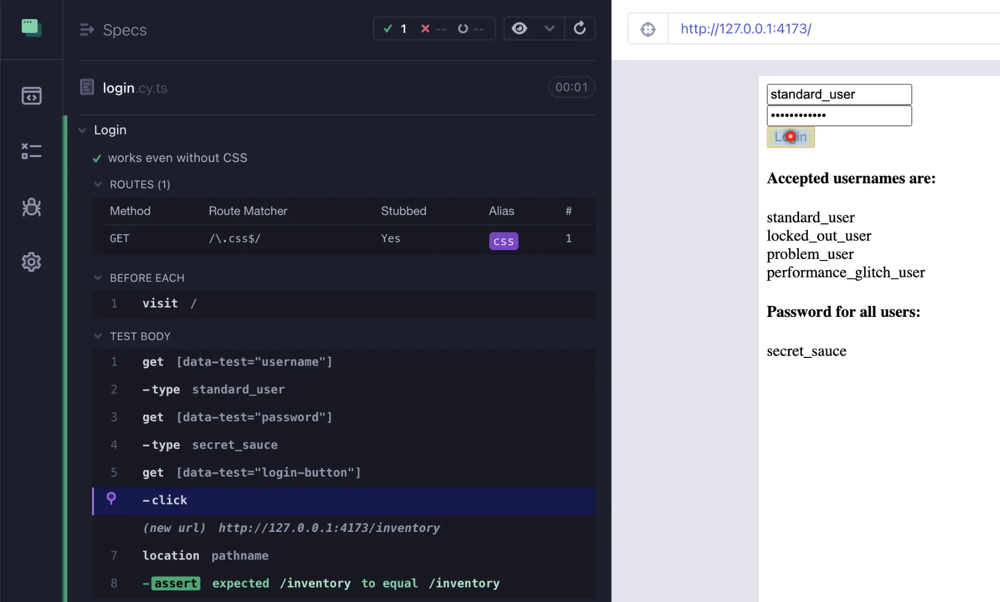
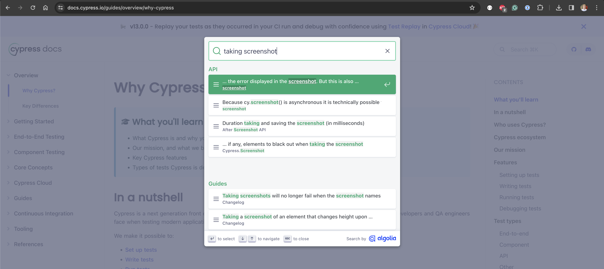
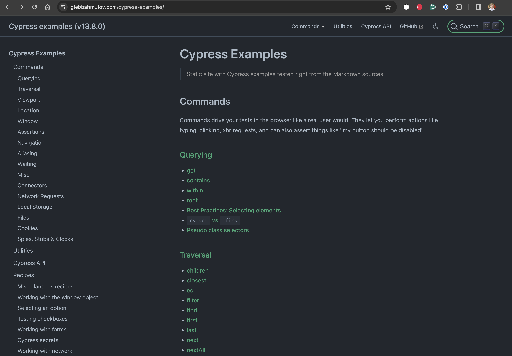
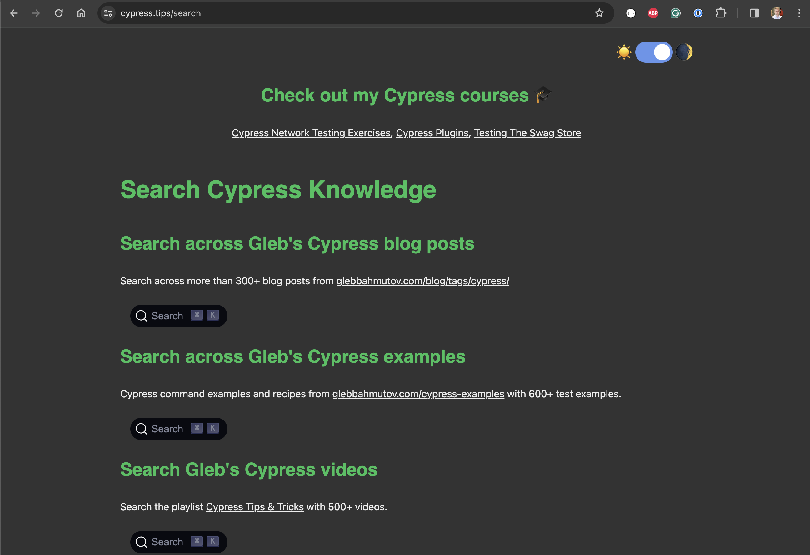

## ☀️ No Style

### 📚 You will learn

- Blocking CSS download using `cy.intercept`
- Testing the app without styles
- Where to find Cypress help

---

## Block CSS bundle

Using branch `a9` as the starting point

```
$ git checkout a9
$ npm install
```

**Tip:** to remove your old work, use `git reset --hard`

+++

For this lesson we will test the production version of our app.

```shell
# build and start the production application
# which runs on http://127.0.0.1:4173/
# and when it responds, open Cypress
$ npm run dev:build
```

+++

This is the script `dev:build` runs in our `package.json` file

```json
{
  "scripts": {
    "build": "vite build",
    "preview": "vite preview",
    "cy:open": "cypress open --e2e",
    "dev:build": "CYPRESS_baseUrl=http://127.0.0.1:4173 start-test preview http://127.0.0.1:4173 cy:open"
  }
}
```

We are changing the `baseUrl` to point at `http://127.0.0.1:4173`

+++

Modify the `beforeEach` hook in the `login.cy.ts` spec file

```js
beforeEach(() => {
  // intercept all CSS requests and respond with an empty string
  // or a 404 error
  // https://on.cypress.io/intercept
  cy.visit('/')
})
```

**Hint:** see the https://on.cypress.io/intercept command documentation

+++

## The solution

```js
beforeEach(() => {
  // intercept all CSS requests and respond with an empty string
  // or a 404 error
  // https://on.cypress.io/intercept
  cy.intercept(
    {
      method: 'GET',
      pathname: /\.css$/,
    },
    {
      error: 404,
    },
  ).as('css')
  cy.visit('/')
})
```

+++



---

## Where to find help

- Cypress documentation [https://docs.cypress.io/](https://docs.cypress.io/)

+++

## Use the search!



+++

- My Cypress examples (600+) https://glebbahmutov.com/cypress-examples/

+++

## Use the search!



+++

My videos, blog posts, examples, courses at https://cypress.tips/search



---

## 🏁 Conclusions

- `cy.intercept` can block network calls
- our Login works even without styles
- there are lots of Cypress resources

➡️ Pick the [next section](https://github.com/bahmutov/cypress-visual-testing-workshop#contents) or jump to the [03-screenshots](?p=03-screenshots) chapter
