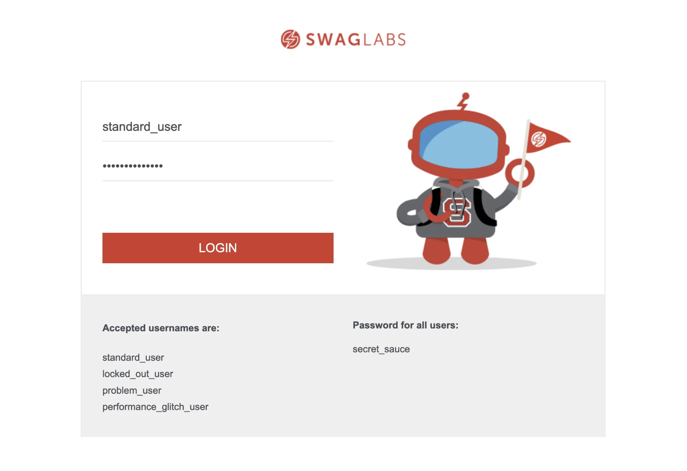
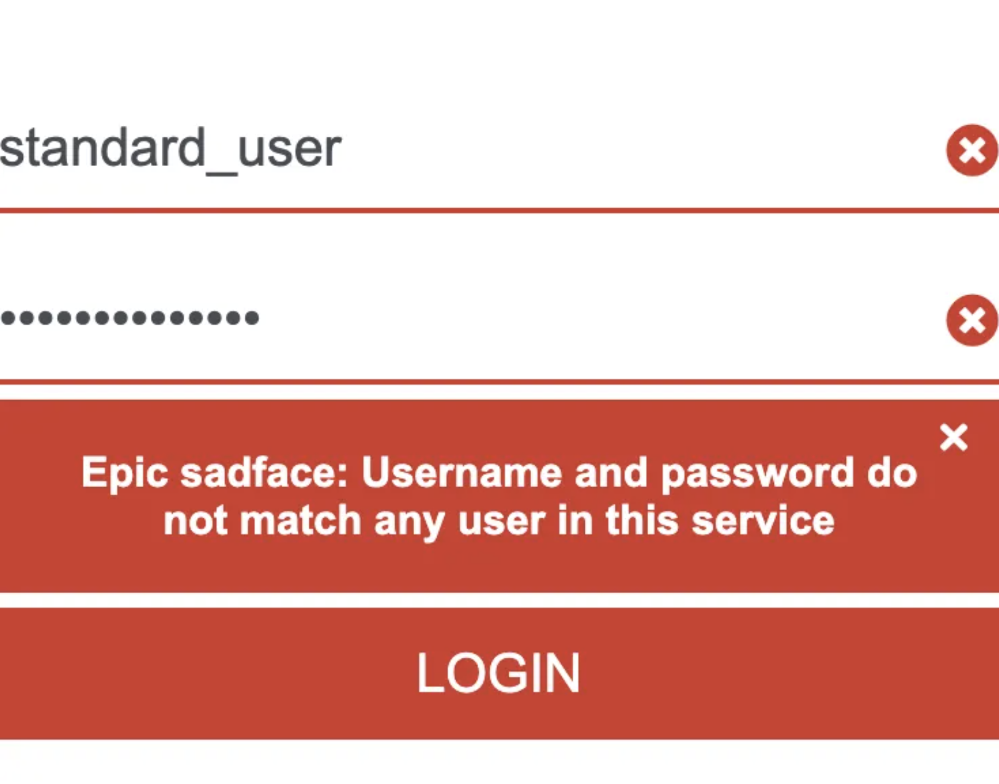
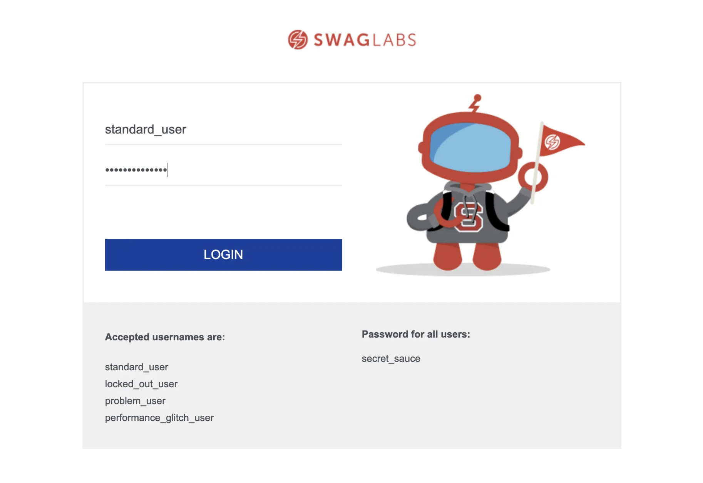
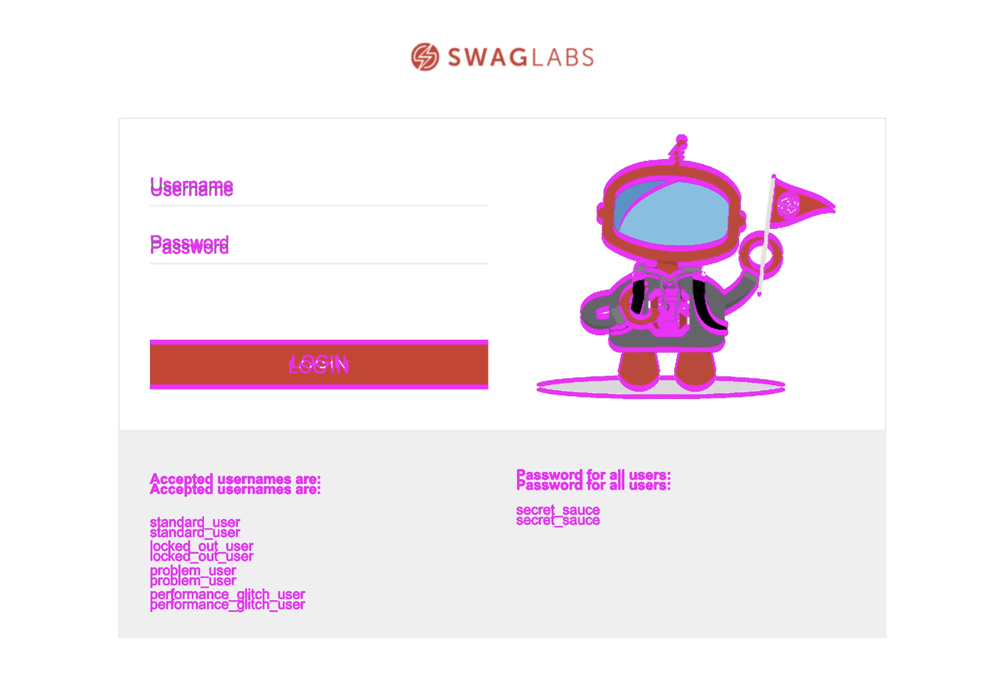
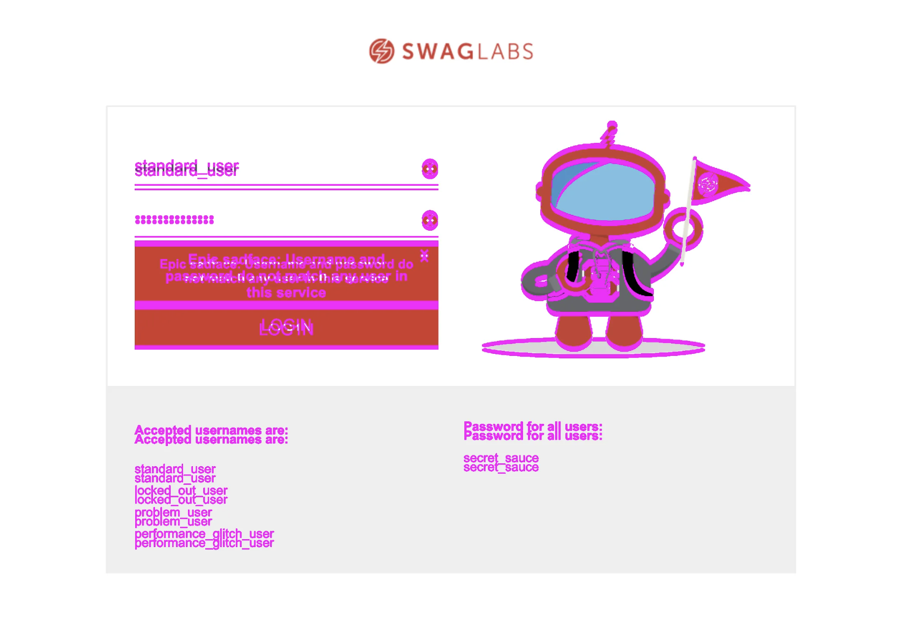

## ☀️ Screenshots

### 📚 You will learn

- Taking screenshots with `cy.screenshot` command
- Comparing images using `odiff` tool

## Taking screenshots

Using branch `b1` as the starting point

```
$ git checkout b1
$ npm install
$ npm run dev
```

+++

```js
it('takes screenshots', () => {
  cy.get(selectors.username).type(user.username)
  cy.get(selectors.password).type('wrong-password')
  // take a screenshot of the entire login page
  // https://on.cypress.io/screenshot
  // try to log in with wrong password
  // take a screenshot of the login form only
  // using id "login_button_container"
})
```

**Tip:** read the [cy.screenshot](https://on.cypress.io/screenshot) doc page first.

+++

Full page screenshot



+++

Login element screenshot



+++

## The solution

```js
it('takes screenshots', () => {
  cy.get(selectors.username).type(user.username)
  cy.get(selectors.password).type('wrong-password')
  // take a screenshot of the entire login page
  // https://on.cypress.io/screenshot
  cy.screenshot('login-page', { overwrite: true })
  // try to log in with wrong password
  cy.get(selectors.loginButton).click()
  // take a screenshot of the login form only
  // using id "login_button_container"
  cy.get('#login_button_container').screenshot('login-form', {
    overwrite: true,
  })
})
```

+++

## Screenshots

Should be stored inside `cypress/screenshots` folder, which is a Cypress config value, see https://on.cypress.io/configuration.

```
cypress/
  screenshots/
    spec name/
      screenshot1.png
```

---

## Comparing screenshots

Visual testing has three main components:

- generating accurate screenshots
- comparing the current screenshots to "gold" images
- reporting results

+++

## Open-source solutions

- `cy.screenshot` for capturing screenshots
- `odiff` for fast image diffing

See https://github.com/dmtrKovalenko/odiff

+++

Starting code in the branch `b2`

```
$ git checkout b2
$ npm install
$ npm run dev
```

+++

## Gold images 🏆

Let's first generate the images that will be the "gold" standard.

- execute `npm run ci` once
- move the screenshots from `cypress/screenshots` to `cypress/gold` folder

+++

## Change CSS

Edit file `src/components/SubmitButton.css`

```css
/* before */
.submit-button {
  background-color: #ffffff;
  border: 2px solid #e2231a;
  ...
}

/* after */
.submit-button {
  background-color: #033ca5 !important;
  border: 2px solid #033ca5 !important;
  ...
}
```

+++

## Run the tests again

```
$ npm run ci
```

Look at the generated screenshot image.

+++

The new screenshot



+++

## Compare images

Using `odiff` command let's find and highlight all pixels with different color values

```
$ npx odiff cypress/gold/login.cy.ts/login-page.png \
  cypress/screenshots/login.cy.ts/login-page.png \
  cypress/screenshots/login.cy.ts/login-page-diff.png \
  --diff-color=#ff00ff
```

+++

## More visual diffing

Starting code in the branch `b3`

```
$ git checkout b3
$ npm install
$ npm run dev
```

+++

## Q: How many screenshots does this test need?

```js
it('logs in', () => {
  // set up several screenshots and save them to the "cypress/gold" folder
  cy.get('.error-message-container').should('be.empty')
  cy.get(selectors.username).type(user.username)
  cy.get(selectors.password).type('wrong-password')
  cy.get(selectors.loginButton).click()
  cy.get('.error-message-container').should('not.be.empty')
})
```

+++

## Probably just two screenshots

- Login page before logging in
- Login page showing an error

```js
it('logs in', () => {
  cy.get('.error-message-container').should('be.empty')
  cy.screenshot('login-page', { overwrite: true })
  cy.get(selectors.username).type(user.username)
  cy.get(selectors.password).type('wrong-password')
  cy.get(selectors.loginButton).click()
  cy.get('.error-message-container').should('not.be.empty')
  cy.screenshot('login-error', { overwrite: true })
})
```

+++

## 💡 Functional assertion before taking screenshot

```js
// 🚨 INCORRECT
// the application might still be processing the click
cy.get(selectors.loginButton).click()
cy.screenshot('login-error', { overwrite: true })

// ✅ RECOMMENDED
cy.get(selectors.loginButton).click()
cy.get('.error-message-container').should('not.be.empty')
cy.screenshot('login-error', { overwrite: true })
```

---

## IMPORTANT: Once you captured screenshots

Move your screenshots to `cypress/gold` folder.

+++

Now check out the Git branch `b3-css`

```
$ git checkout b3-css
```

There are some CSS changes between `b3` and `b3-css`. Can you generate the screenshots and diff them again? How many different pixels did it find?

+++

Login page diff image



+++

Login error page diff image



---

## 🏁 Conclusions

- `cy.screenshot` command saves the app or element looks
- 3rd-party plugin `odiff` compares "gold" images with the current screenshots
- even a small CSS change can lead to large image differences

➡️ Pick the [next section](https://github.com/bahmutov/cypress-visual-testing-workshop#contents) or jump to the [01-basic](?p=01-basic) chapter
