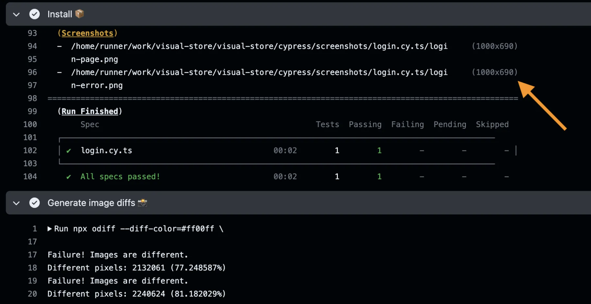
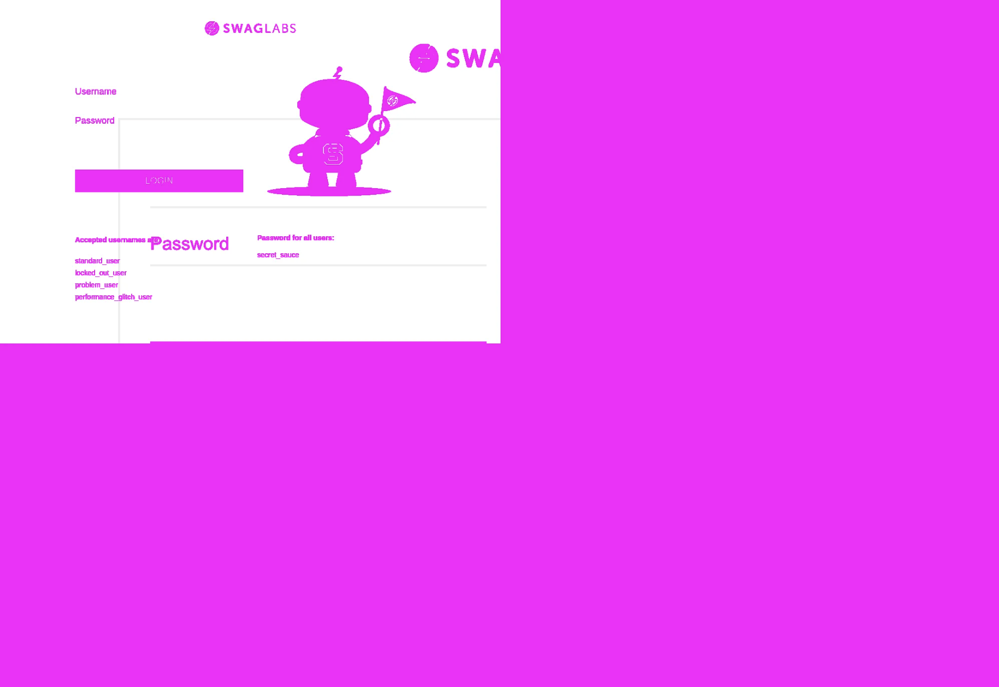

## ☀️ Continuous Integration

### 📚 You will learn

- Running Cypress tests using GitHub Actions
- Storing screenshots and image diffs as test artifacts
- Normalizing the output image resolution

---

## Capture screenshots on CI

Using branch `b4` as the starting point

```
$ git checkout b4
$ npm install
```

+++

## 💡 Fork the repo

For this exercise, a good idea is to fork the repository so you can see your own GitHub Actions running.

+++

## Finish the workflow file

+++

```yml
# .github/workflows/ci.yml

# https://github.com/cypress-io/github-action
- name: Install 📦
  uses: cypress-io/github-action@v6
  with:
    start: npm start
    wait-on: 'http://127.0.0.1:3000'

# generate image diffs between two gold images
# and the two screenshots
# Tip: always run this step, even if the tests fail
# Tip 2: use "|| true" to ignore any diff errors
# since there might be no screenshots
- name: Generate image diffs 📸
  run: |
    # npx odiff ...

# after the test run completes store the screenshots and diffs
- name: Save screenshots 📸
  # https://github.com/actions/upload-artifact
  uses: actions/upload-artifact@v4
  # always upload the screenshots, even if the tests fail
  if: always()
  # with:
  # name: <artifact name>
  # path: <folder with screenshots>
  # if-no-files-found: ignore
```

+++

## The solution

```yml
# https://github.com/cypress-io/github-action
- name: Install 📦
  uses: cypress-io/github-action@v6
  with:
    start: npm start
    wait-on: 'http://127.0.0.1:3000'

# generate image diffs between two gold images
# and the two screenshots
# Tip: always run this step, even if the tests fail
# Tip 2: use "|| true" to ignore any diff errors
# since there might be no screenshots
- name: Generate image diffs 📸
  run: |
    npx odiff --diff-color=#ff00ff \
    cypress/gold/login.cy.ts/login-page.png \
    cypress/screenshots/login.cy.ts/login-page.png \
    cypress/screenshots/login-page-diff.png || true
    # the second image
    npx odiff --diff-color=#ff00ff \
    cypress/gold/login.cy.ts/login-error.png \
    cypress/screenshots/login.cy.ts/login-error.png \
    cypress/screenshots/login-error-diff.png || true

# after the test run completes store the screenshots and diffs
- name: Save screenshots 📸
  # https://github.com/actions/upload-artifact
  uses: actions/upload-artifact@v4
  # always upload the screenshots, even if the tests fail
  if: always()
  with:
    name: cypress-screenshots
    path: cypress/screenshots
    if-no-files-found: ignore
```

+++

## Run the workflow on CI

Did the CI run finish? Can you look at the diff images? Did they match the images you generated locally and stored in the `cypress/gold` folder?

+++

## I see a mismatch between Mac and Linux



On Mac local images are 2000x1380.

+++

## The diff image



---

## Normalize device scale factor

Using branch `b5` as the starting point

```
$ git checkout b5
$ npm install
```

+++

## Chrome Debugger Protocol

- allows browser automation https://chromedevtools.github.io/devtools-protocol/
- exposed by default in Cypress https://glebbahmutov.com/blog/cypress-automation/
- wrapped by `cypress-cdp` plugin for convenience

+++

```js
// https://github.com/bahmutov/cypress-cdp
import 'cypress-cdp'

it('...', () => {
  // call a CDP command and pass the options object
  cy.CDP(domain, options)
})
```

+++

## Set device scale using CDP

```js
// cypress/e2e/login.cy.ts

beforeEach(() => {
  // set the browser to emulate a desktop device
  // with fixed dimensions and no device scale factor
  // https://chromedevtools.github.io/devtools-protocol/tot/Emulation/#method-setDeviceMetricsOverride

  cy.visit('/')
})
```

+++

## The solution

```js
// cypress/e2e/login.cy.ts

beforeEach(() => {
  // set the browser to emulate a desktop device
  // with fixed dimensions and no device scale factor
  // https://chromedevtools.github.io/devtools-protocol/tot/Emulation/#method-setDeviceMetricsOverride
  cy.CDP('Emulation.setDeviceMetricsOverride', {
    width: 1280,
    height: 720,
    mobile: false,
    deviceScaleFactor: 1,
  })

  cy.visit('/')
})
```

---

## 🏁 Conclusions

- `cy.screenshot` saves an image with the resolution dependent on the OS settings
- you can control the device scale factor using CDP

➡️ Pick the [next section](https://github.com/bahmutov/cypress-visual-testing-workshop#contents) or jump to the [05-customize](?p=05-customize) chapter
