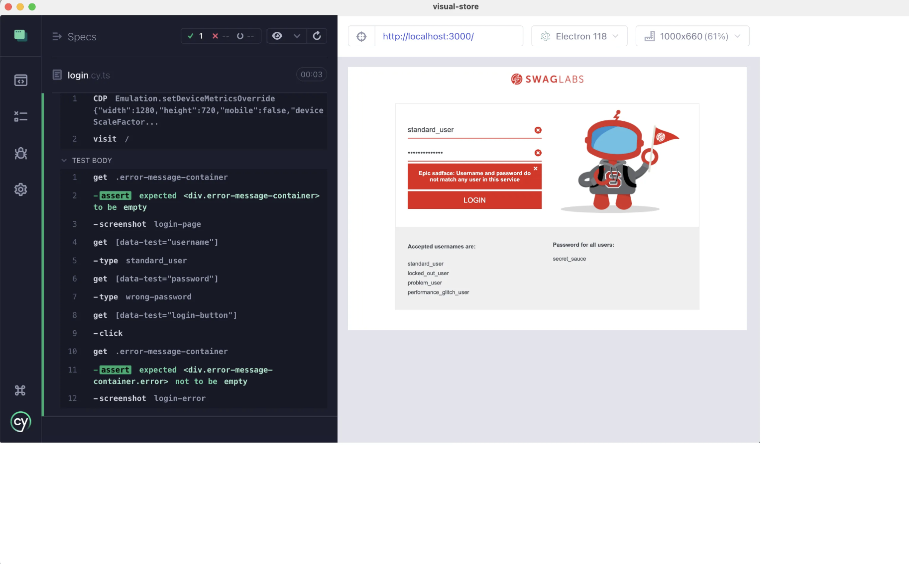
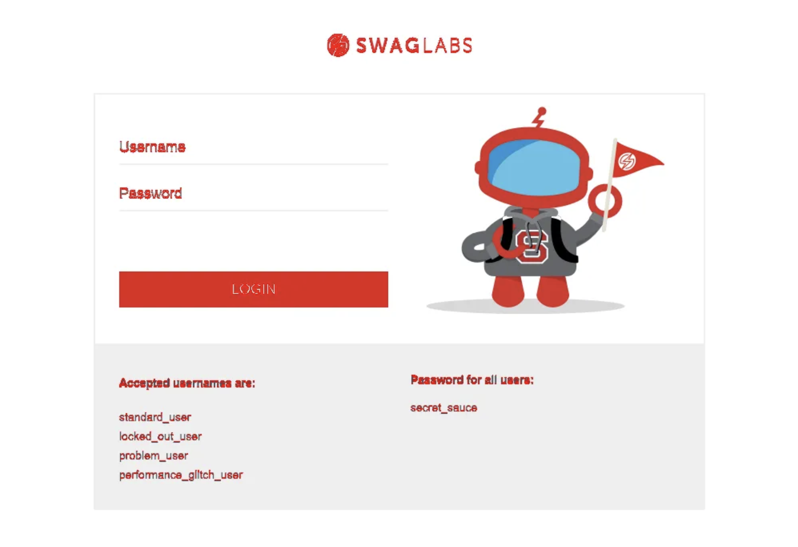
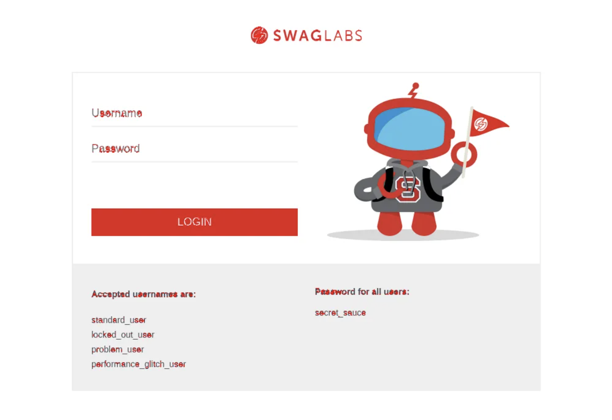

## ☀️ Customize Screenshots

### 📚 You will learn

- Control how and if Cypress takes screenshots
- Compare images using antialiasing detection

---

## Skip screenshots in the interactive mode

Using branch `b6` as the starting point

```
$ git checkout b6
$ npm install
```

+++

## Problem with custom scale factor



+++

## We don't want to always set the scale factor

Let's only set it when we are running tests in the `cypress run` mode, but not when using `cypress open`

+++

## The starting code

```js
// cypress/e2e/login.cy.ts

beforeEach(() => {
  // set the browser to emulate a desktop device
  // with fixed dimensions and no device scale factor
  // https://chromedevtools.github.io/devtools-protocol/tot/Emulation/#method-setDeviceMetricsOverride
  cy.CDP('Emulation.setDeviceMetricsOverride', {
    width: 1280,
    height: 720,
    mobile: false,
    deviceScaleFactor: 1,
  })

  cy.visit('/')
})
```

Can you move the code above to the E2E support file?

+++

```js
// cypress/support/e2e.ts

// we need to know if we are running in interactive mode
// "cypress open" or in headless mode "cypress run
const interactiveMode = Cypress.config('isInteractive')

// only set the device metrics in headless mode
// in interactive mode we want to skip taking screenshots
// using Cypress.Commands.overwrite
// https://on.cypress.io/custom-commands
if (!interactiveMode) {
  before(() => {
    // set the browser to emulate a desktop device
    // with fixed dimensions and no device scale factor
    // https://chromedevtools.github.io/devtools-protocol/tot/Emulation/#method-setDeviceMetricsOverride
  })
} else {
  // use Cypress.Commands.overwrite()
}
```

+++

## The solution

```js
const interactiveMode = Cypress.config('isInteractive')

if (!interactiveMode) {
  before(() => {
    cy.CDP('Emulation.setDeviceMetricsOverride', {
      width: 1280,
      height: 720,
      mobile: false,
      deviceScaleFactor: 1,
    })
  })
} else {
  Cypress.Commands.overwrite(
    'screenshot',
    // @ts-ignore
    (originalFn, subject, name, options) => {
      cy.log(`skipping screenshot "${name}" in interactive mode`)
    },
  )
}
```

---

## Anti-aliasing for text comparison

Use the branch `b7` for this lesson

```
$ git checkout b7
$ npm install
```

+++

## Compare the two gold images

One for Mac, one for Linux.

Can you compare the two images in the `cypress/gold` using the `odiff` utility. The images look identical, but are they?

+++

## Compare the images

```
$ npx odiff cypress/gold/login.cy.ts/login-page-linux.png \
  cypress/gold/login.cy.ts/login-page-mac.png \
  diff.png

Failure! Images are different.
Different pixels: 4305 (0.623913%)
```

+++

## The image difference



+++

## Compare the images with antialiasing

```
$ npx odiff --antialiasing \
  cypress/gold/login.cy.ts/login-page-linux.png \
  cypress/gold/login.cy.ts/login-page-mac.png \
  diff.png

Failure! Images are different.
Different pixels: 1863 (0.270000%)
```

Much closer.

+++



---

## 🏁 Conclusions

- `cy.screenshot` saves an image with the resolution dependent on the OS settings
- you can control the device scale factor using CDP
- `odiff` can ignore (a little) tiny pixel differences at the edges of sharp lines

➡️ Pick the [next section](https://github.com/bahmutov/cypress-visual-testing-workshop#contents) or jump to the [01-basic](?p=01-basic) chapter
