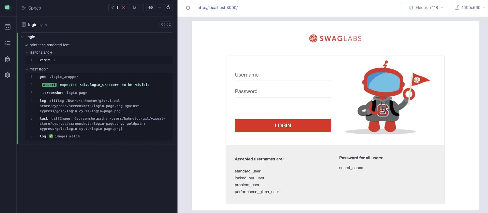
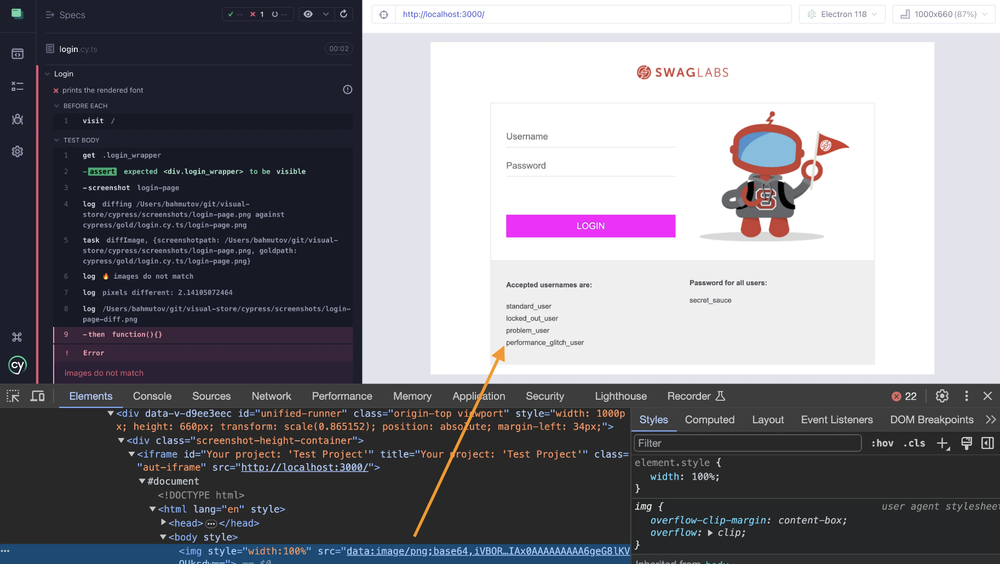

## ☀️ Diff images

### 📚 You will learn

- How to diff images yourself
- How to report image diffing results

---

## Diff images from Node

Using branch `c1` as the starting point

```
$ git checkout c1
$ npm install
```

Tool `odiff` includes Node.js bindings, see https://github.com/dmtrKovalenko/odiff

+++

## The goal

- use the existing Cy task `diffImage` to compare the current screenshot with the gold image and report the result to the user

```ts
cy.task<ODiffResult>('diffImage', { screenshotPath, goldPath }).then(
  (result) => {
    // report the image diffing result, which could be
    // 1: a new image (no previous gold image found)
    // 2: images match
    // 3: images do not match
    // In that case log the diff image path
    // and the percentage of different pixels
    // and then grab the diff image and insert it into the DOM
    // using cy.document and base64 encoded image
    // https://on.cypress.io/document
    // https://on.cypress.io/readfile
    // Tip: make sure to throw an error at the end to fail the test
  },
)
```

+++

## The solution

```ts
cy.task<ODiffResult>('diffImage', { screenshotPath, goldPath }).then(
  (result) => {
    if (result.match === true) {
      if ('newImage' in result && result.newImage) {
        cy.log('✅ new image')
      } else {
        cy.log('✅ images match')
      }
    } else {
      cy.log('🔥 images do not match')
      if (result.reason === 'pixel-diff') {
        cy.log(`pixels different: ${result.diffPercentage}`)
        cy.log(result.diffImagePath)
        cy.readFile(result.diffImagePath, 'base64', {
          log: false,
        }).then((diffImage) => {
          cy.document({ log: false })
            .its('body', { log: false })
            .then((body) => {
              body.innerHTML =
                ''
              throw new Error('images do not match')
            })
        })
      }
    }
  },
)
```

+++

## The images match



+++

## Change CSS

Copy the screenshot to the `cypress/gold` folder before changing the CSS file `src/components/SubmitButton.css`

```css
.submit-button {
  /* original style */
  background-color: #ffffff;
  border: 2px solid #e2231a;
  /* changed style */
  /* background-color: #033ca5 !important;
  border: 2px solid #033ca5 !important; */
  /* the rest of properties */
}
```

+++

## The images do not match

The current diff image is shown



---

## 🏁 Conclusions

- `odiff` can be called from any Node.js program
- your tests can call `odiff` from the Cypress config file
- your tests can then report the results of matching the images

➡️ Pick the [next section](https://github.com/bahmutov/cypress-visual-testing-workshop#contents) or jump to the [07-ci-workflow](?p=07-ci-workflow) chapter
