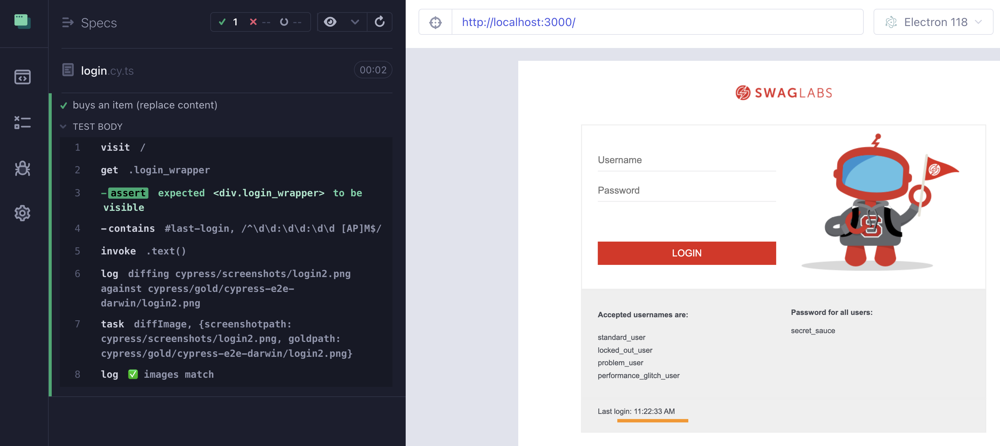

## ☀️ Dynamic Data

### 📚 You will learn

- dealing with timestamps
- dealing with dynamic server data
- approving diffs from Cypress

---

## Page shows a timestamp

Using branch `c6` as the starting point

```
$ git checkout c6
$ npm install
```

+++

## There is a timestamp


+++

## Deal with dynamic data

**Same data → Same page → Same image**.

Timestamp / date / clock is an example of dynamic data.

+++

## Deal with dynamic data

1. Mock or stub the data source
2. Check and replace dynamic data

+++

## Solve the spec

```js
// the login page includes a "last login" element
// that changes every time the page is loaded
// It really shows the current time
// How do we perform visual testing in the presence
// of a dynamic time stamp?
// 1: use cy.clock to set the current date before the cy.visit
// https://on.cypress.io/clock
// 2: confirm the time is displayed correctly
// but then replace it with synthetic constant
// and then take a snapshot
it('buys an item', () => {
  cy.visit('/')
  cy.get('.login_wrapper').should('be.visible')
  // cannot take a screenshot since it is always different
  // cy.imageDiff('login')
})
```

+++

## The solution: stub the clock

```ts
it('buys an item', () => {
  // solution 1: use synthetic time
  cy.clock(new Date(2020, 1, 14, 12, 34, 56))
  cy.visit('/')
  cy.get('.login_wrapper').should('be.visible')
  cy.imageDiff('login')
})
```

+++


+++

## The solution: check and replace

```ts
it('buys an item (replace content)', () => {
  // solution 2: replace the dynamic text
  cy.visit('/')
  cy.get('.login_wrapper').should('be.visible')
  // confirm the dynamic text has the right format
  cy.contains('#last-login', /^\d?\d:\d\d:\d\d [AP]M$/)
    // and then replace the dynamic text with static timestamp
    .invoke('text', '11:22:33 AM')
  cy.imageDiff('login2')
})
```

+++



---

## Dynamic server data

Code for this exercise

```
$ git checkout c7
$ npm install
```

+++

## Dynamic data fetched from the server


+++

## Solve 1: stub the network call

```js
it('shows the stats before login (stub the network call)', () => {
  // stub the network call and give it an alias
  // https://on.cypress.io/intercept
  // https://on.cypress.io/as
  cy.visit('/')
  // confirm the network call was made
  // confirm the page shows the fetched data
  cy.get('#login_stats').should('be.visible')
  // visual assertion
  // cy.imageDiff('stats-mock')
})
```

+++

## The solution 1: stub the network call

```js
it('shows the stats before login (stub the network call)', () => {
  // stub the network call and give it an alias
  // https://on.cypress.io/intercept
  // https://on.cypress.io/as
  cy.intercept(apiServerUrl, mockData).as('getStats')
  cy.visit('/')
  // confirm the network call was made
  cy.wait('@getStats')
  // confirm the page shows the fetched data
  cy.get('#login_stats').should('be.visible')
  // visual assertion
  cy.imageDiff('stats-mock')
})
```

+++


+++

## Solve 2: check and replace

```js
it('shows the stats before login (confirm the fetched data is shown)', () => {
  // do not stub the network call and give it an alias
  // https://on.cypress.io/intercept
  // https://on.cypress.io/as
  cy.visit('/')
  // confirm the page shows the fetched data
  // https://on.cypress.io/wait
  // https://on.cypress.io/its

  cy.get('#login_stats').should('be.visible')
  // confirm the server response is shown
  // and replace each field on the page with mock data
  // now the data is stable and we can take the screenshot
  // cy.imageDiff('stats-replaced')
})
```

+++

## The solution 2: check and replace

```js
it('shows the stats before login (confirm the fetched data is shown)', () => {
  // do not stub the network call and give it an alias
  // https://on.cypress.io/intercept
  // https://on.cypress.io/as
  cy.intercept(apiServerUrl).as('getStats')
  cy.visit('/')
  // confirm the page shows the fetched data
  cy.wait('@getStats')
    .its('response.body')
    .then((data) => {
      cy.get('#login_stats').should('be.visible')
      // confirm the server response is shown
      // and replace each field on the page with mock data
      cy.contains('.total-items', data.totalItems).invoke('text', '777')
      cy.contains('.last-item', data.lastSoldItem).invoke('text', 'Plasma TV')
    })
  // now the data is stable and we can take the screenshot
  cy.imageDiff('stats-replaced')
})
```

+++


---

## Approve changed image file from Cypress

```
$ git checkout c8
$ npm install
```

+++

## The random data from the server

The test will get a visual diff on every run.

```js
it('shows a visual difference on each run', () => {
  cy.visit('/')
  // confirm the page shows the fetched data
  cy.get('#login_stats').should('be.visible')
  // visual assertion that will fail because
  // each screenshot will see something new
  cy.imageDiff('login')
})
```

+++

## Do you see the "approve" button?


---

## 🏁 Conclusions

- You must deal with dynamic / random / nondeterministic data
- For timestamps / dates you can use `cy.clock`
- For data fetched from the server you can use `cy.intercept`

➡️ Pick the [next section](https://github.com/bahmutov/cypress-visual-testing-workshop#contents)
