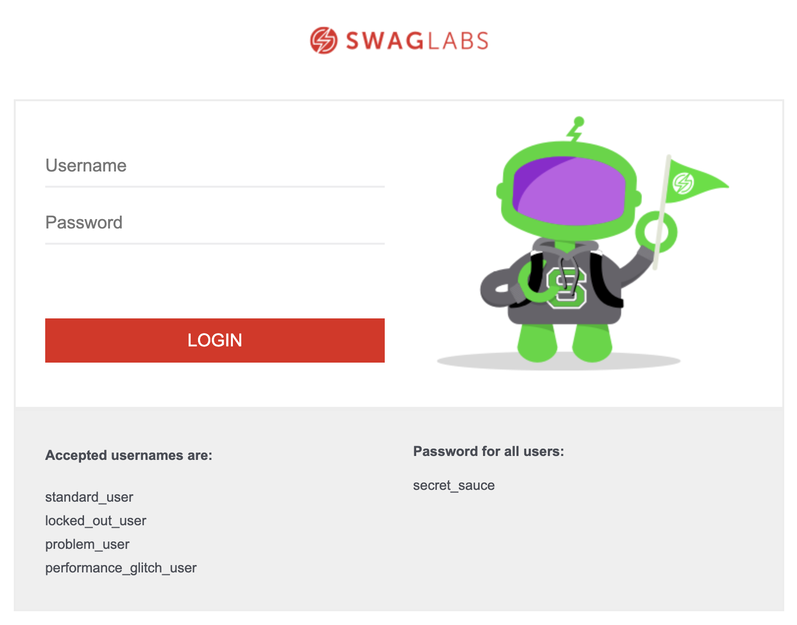
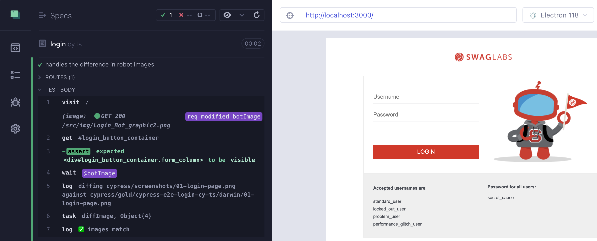
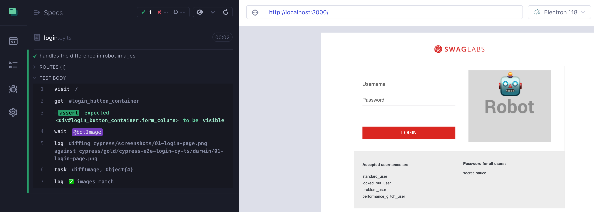
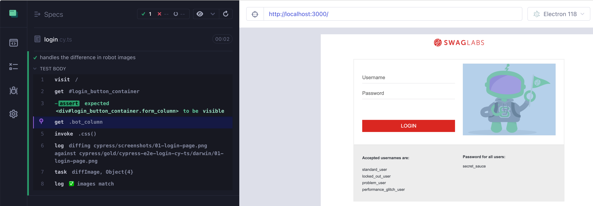
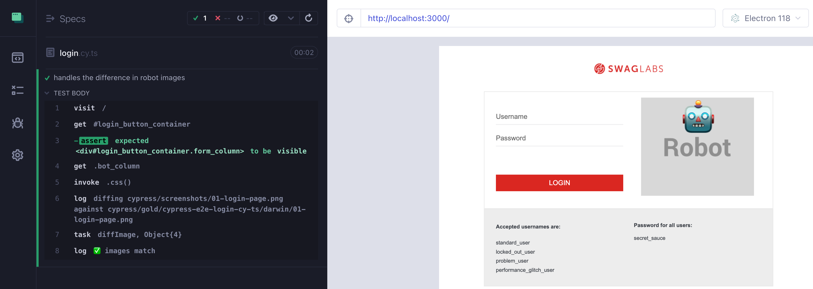
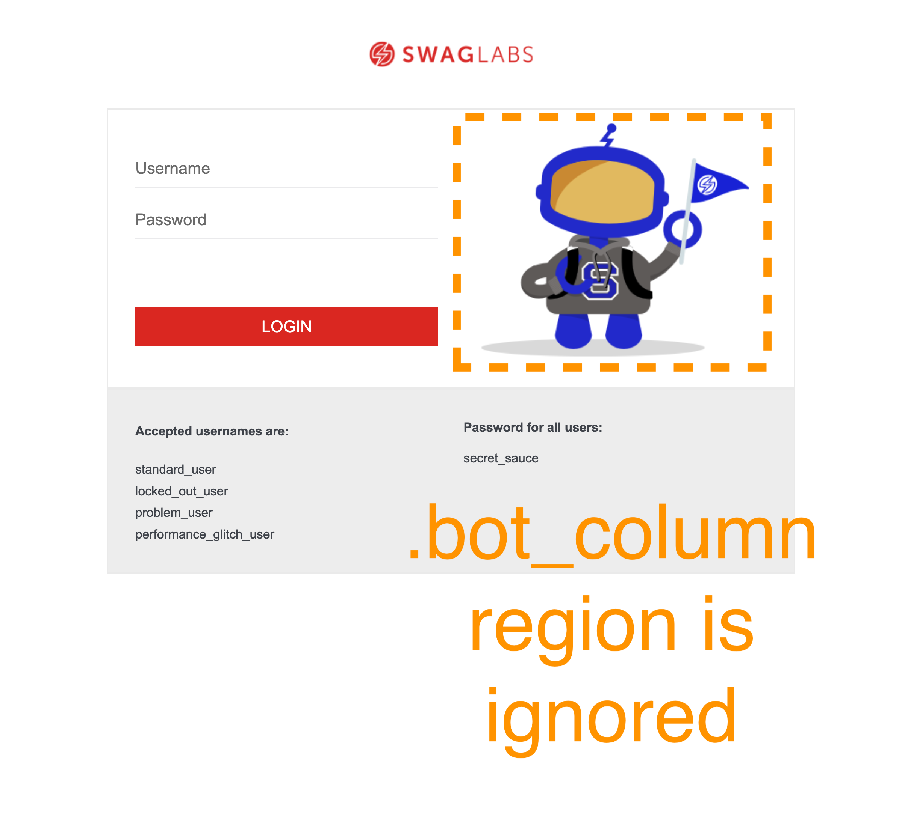

## 🤖 Random Robot

### 📚 You will learn

- how to deal with a random robot image
  - using network redirect
  - using network stub
  - replacing image source attribute
  - ignoring a part of an image during diffing

---

## Random robot

Using branch `d5` as the starting point

```
$ git checkout d5
$ npm install
```

+++

## Robot image changes



+++

The app randomly loads one of these robot images:

- `http://127.0.0.1:3000/src/img/Login_Bot_graphic.png`
- `http://127.0.0.1:3000/src/img/Login_Bot_graphic2.png`
- `http://127.0.0.1:3000/src/img/Login_Bot_graphic3.png`

+++

## The spec

```js
it('handles the difference in robot images', () => {
  // intercept the outgoing request to any of the robot images
  // that have form like '**/Login_Bot_graphic*.png'
  // and replace it with the exact file name 'Login_Bot_graphic.png'
  // so it always returns the first bot image
  // https://on.cypress.io/intercept
  // give the intercept an alias "botImage"
  cy.visit('/')
  cy.get('#login_button_container').should('be.visible')
  // confirm the bot image intercept was used
  // https://on.cypress.io/wait
  cy.imageDiff('01-login-page', { mode: 'sync' })
})
```

**Tip:** use https://on.cypress.io/intercept

+++

## The solution

```js
it('handles the difference in robot images', () => {
  cy.intercept('GET', '**/Login_Bot_graphic*.png', (req) => {
    const sameUrl = req.url.replace(
      /Login_Bot_graphic.*\.png/,
      'Login_Bot_graphic.png',
    )
    console.log('replacing url', req.url, 'with', sameUrl)
    req.url = sameUrl
  }).as('botImage')
  cy.visit('/')
  cy.get('#login_button_container').should('be.visible')
  cy.wait('@botImage')
  cy.imageDiff('01-login-page', { mode: 'sync' })
})
```

+++



---

## Stub the network call

```
$ git checkout d6
$ npm install
```

There is a fixture robot image `cypress/fixtures/robot_placeholder.png`

+++

## The spec

```js
it('handles the difference in robot images', () => {
  // intercept the outgoing request to any of the robot images
  // that have form like '**/Login_Bot_graphic*.png'
  // and replace it with the fixture image "robot-placeholder.png"
  // https://on.cypress.io/intercept
  // give the intercept an alias "botImage"
  cy.visit('/')
  cy.get('#login_button_container').should('be.visible')
  // confirm the bot image intercept was used
  // https://on.cypress.io/wait
  cy.imageDiff('01-login-page', { mode: 'sync' })
})
```

+++

## The solution

```js
it('handles the difference in robot images', () => {
  cy.intercept('GET', '**/Login_Bot_graphic*.png', {
    fixture: 'robot-placeholder.png',
  }).as('botImage')
  cy.visit('/')
  cy.get('#login_button_container').should('be.visible')
  cy.wait('@botImage')
  cy.imageDiff('01-login-page', { mode: 'sync' })
})
```

+++



---

## Replace image source attribute

```
$ git checkout d7
$ npm install
```

+++

## The spec

```js
it('handles the difference in robot images', () => {
  cy.visit('/')
  cy.get('#login_button_container').should('be.visible')
  // load the robot placeholder fixture using "base64" encoding
  // https://on.cypress.io/fixture
  // form a base64 encoded image URL
  // and set it as the background image of the element ".bot_column"
  // tip: the CSS property "background-image" required
  // the form "url('data:image/png;base64,...')"
  // now the image diff should be stable and pass
  // cy.imageDiff('01-login-page', { mode: 'sync' })
})
```

+++

## The solution

```js
it('handles the difference in robot images', () => {
  cy.visit('/')
  cy.get('#login_button_container').should('be.visible')
  cy.fixture('robot-placeholder.png', 'base64').then((image) => {
    const base64 = `url("data:image/png;base64,${image}")`
    cy.get('.bot_column').invoke('css', 'background-image', base64)
  })
  cy.imageDiff('01-login-page', { mode: 'sync' })
})
```

+++

## Real image is loaded



+++

## Fake image is set



---

## Ignore image regions

```
$ git checkout d8
$ npm install
```

I added support for ignoring elements and their bounding rectangles when diffing.

+++

## The spec

```js
it('handles the difference in robot images', () => {
  cy.visit('/')
  cy.get('#login_button_container').should('be.visible')
  // image diff the entire page
  // but ignore any element with the class "bot_column"
  // see the cy.imageDiff JSDoc documentation
  // in the file cypress/support/index.d.ts
  // cy.imageDiff('01-login-page', { ... })
})
```

+++

## Ignored element



+++

## The solution

```js
it('handles the difference in robot images', () => {
  cy.visit('/')
  cy.get('#login_button_container').should('be.visible')
  cy.imageDiff('01-login-page', {
    mode: 'sync',
    ignoreElements: '.bot_column',
  })
})
```

Rerun the page multiple times. The robot image changes, yet the image matches against the gold image.

---

## 🏁 Conclusions

- you can redirect the network request to stable data
- you can stub the network request using a fixture image
- you can overwrite the loaded image using a fixture image
- you can ignore regions when diffing the images

➡️ Pick the [next section](https://github.com/bahmutov/cypress-visual-testing-workshop#contents) or jump to the [11-element-diff](?p=11-element-diff)
