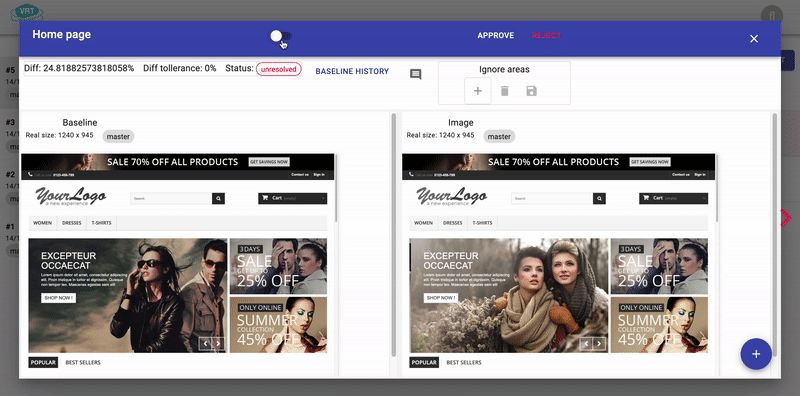
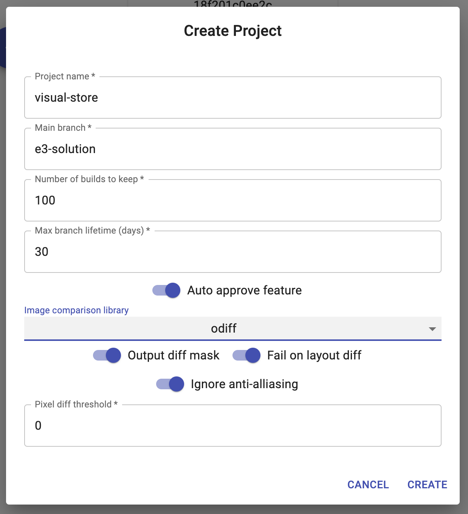
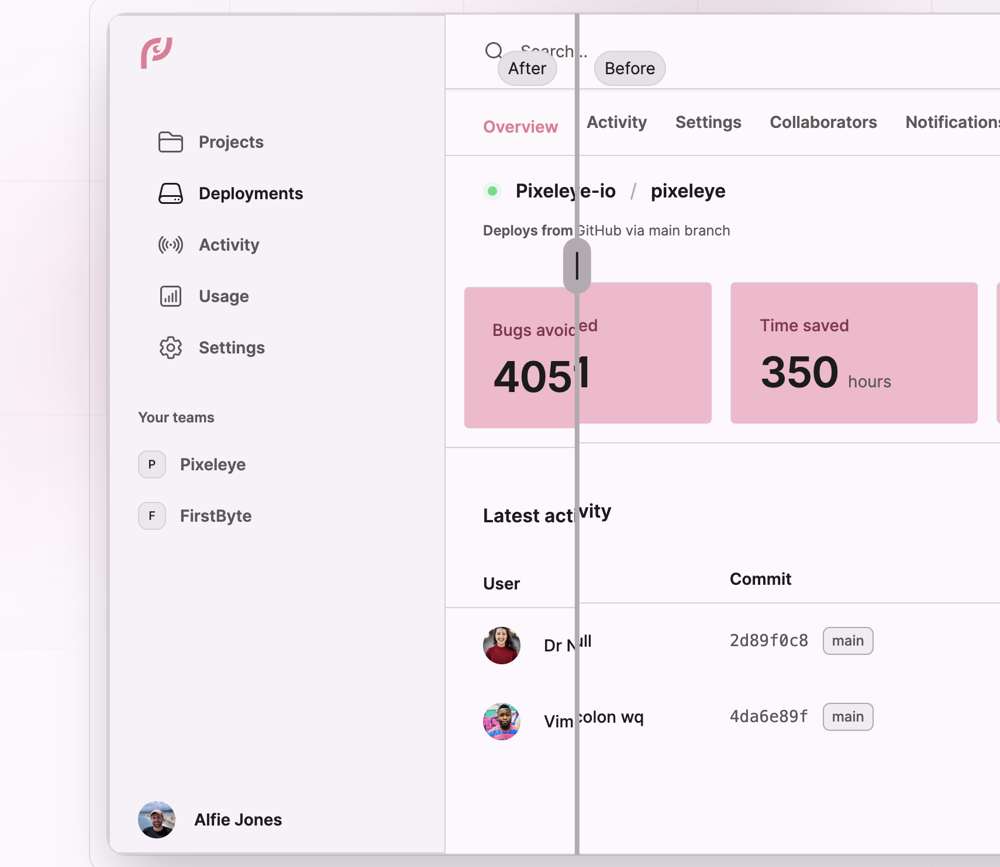

## ☀️ Visual Testing Services

### 📚 You will learn

- open-source vs commercial
- Visual Regression Tracker
- Pixeleye
- 📝 https://on.cypress.io/visual-testing

---

## Open-source Do-it-yourself

- free (if your time is free)
- on-premises / security
- custom

+++

## Commercial

- Applitools, Percy, Happo
- expensive 💰
- powerful features

---

## Visual Regression Tracker

- https://github.com/Visual-Regression-Tracker/Visual-Regression-Tracker
- test runner "agents" for different test runners
- "bring your own screenshot"
- Docker compose

+++



Showing: mark regions to ignore

+++

## VRT commands

```js
before(() => {
  cy.vrtStart()
})

it('...', () => {
  cy.vrtTrack('login-page')
  cy.get('footer').vrtTrack('footer')
})
```

+++



Choice of image diffing plugins

---

## Pixel 👁️

- https://pixeleye.io/home
- host it yourself (Docker) or their commercial service
- powerful web UI
- integrations (GitHub, email)

+++



- https://pixeleye.io/playground

---

## The bad news 📰

- I tried to self-host both VRT and Pixeleye and failed 😔
- Stay tuned for further attempts https://glebbahmutov.com/blog/

---

## 🏁 Conclusions

- visual testing services make storing images and reviews easy
- open-source means you pay to maintain
- commercial services are expensive

➡️ Pick the [next section](https://github.com/bahmutov/cypress-visual-testing-workshop#contents) or jump to the [end](?p=end)
