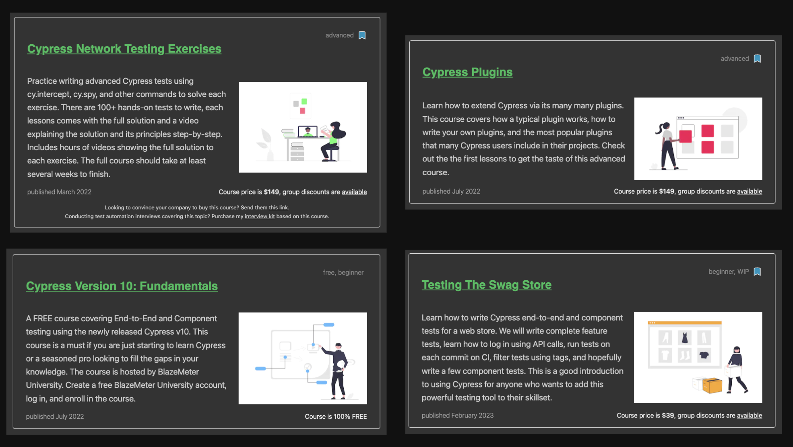

# Cypress Visual Testing Workshop

- [github.com/bahmutov/cypress-visual-testing-workshop](https://github.com/bahmutov/cypress-visual-testing-workshop)

Jump to: [00-styles](?p=00-styles), [01-waiting](?p=01-waiting), [02-no-style](?p=02-no-style), [03-screenshots](?p=03-screenshots), [04-ci](?p=04-ci), [05-customize](?p=05-customize), [06-diff](?p=06-diff), [07-ci-workflow](?p=07-ci-workflow)

+++

## Author: Gleb Bahmutov, PhD

- Ex-VP of Engineering at Cypress
- Ex-Distinguished Engineer at Cypress
- actively using Cypress since 2016
- [gleb.dev](https://gleb.dev)
- [@bahmutov](https://twitter.com/bahmutov)
- [https://glebbahmutov.com/blog/tags/cypress/](https://glebbahmutov.com/blog/tags/cypress/) 300+ Cypress blog posts
- [https://www.youtube.com/glebbahmutov](https://www.youtube.com/glebbahmutov) 500+ Cypress videos
- [cypress.tips](https://cypress.tips) with links, search, my courses
- [Cypress Tips](https://cypresstips.substack.com/) monthly newsletter
- author of [Cypress Visual Testing Docs](https://on.cypress.io/visual-testing)

+++

[cypress.tips/courses](https://cypress.tips/courses)



---

## What we are going to cover 1/2

- functional Cypress testing
  - to get a sense of Cy skills
- CSS assertions and computed styles
- CSS animations
- `cy.screenshot` command
- `odiff` image diffing
- writing our own diffing JS code

+++

## What we are going to cover 2/2

- sync vs async diffing
- open-source vs paid services
- `cypress-odiff` plugin
- Visual Regression Tracker
- Pixeleye

---

## Schedule 🕰

- 09.00am - 12.00pm PM Monday 22nd
- 09.00am - 12.00pm PM Thursday 25nd
- time for questions during the workshop and after each section
- water break after each hour
- reconnect to Google Meet (?) every hour

+++

<!-- Please: if you have experience with Cypress.io, help others during the workshop 🙏 -->

## Poll 1 🗳️: have you used Cypress before?

- This is my first time
- Using for less than 1 month 👍<!-- .element: class="fragment" -->
- Using it for less than 1 year 👍👍<!-- .element: class="fragment" -->
- Using for longer than 1 year ❤️<!-- .element: class="fragment" -->
- Using for longer than 2 years ❤️❤️<!-- .element: class="fragment" -->

---

## Cypress Skills Ladder 🪜

[https://cypress.tips/skills](https://cypress.tips/skills)

---

## Poll 2 🗳️: Do you use TypeScript

- no
- a little <!-- .element: class="fragment" -->
- half of the time <!-- .element: class="fragment" -->
- all the time <!-- .element: class="fragment" -->

---

## How efficient learning works

1. I explain and show
2. We do together
3. You do and I help

Test repo https://github.com/bahmutov/visual-store

+++

Test repo https://github.com/bahmutov/visual-store

Each exercise is a branch like `a1`, `a2`, etc. These branches are starting points

```
$ git checkout a1
$ npm install
```

---

## Requirements

- A GitHub account
- fork the exercise repo https://github.com/bahmutov/visual-store
- `git` to clone the repo to your local machine
- Node v20+

```text
git clone <repo url>
cd visual-store
npm install
```

**Tip:** make sure to run the `npm install` after each `git checkout` command.

---

## The app

- `npm start` runs the app by itself
- `npm run dev` runs the app and opens Cypress

+++


+++

## Lesson a1

Let's write 3 small tests for app Login

- `cd visual-store`
- `git checkout a1`
- `npm run dev`

Do you see the starting tests?

+++


+++

Spec file `cypress/e2e/login.cy.ts` test 1/3

```ts
it('wrong password', () => {
  // type the valid username and some made up password
  // https://on.cypress.io/get
  // https://on.cypress.io/type
  //
  // click on the login button
  // https://on.cypress.io/click
  //
  // confirm the page shows errors and stays on login URL
  // https://on.cypress.io/contains
  // https://on.cypress.io/location
})
```

+++

## Solution 1/3

```ts
it('wrong password', () => {
  cy.get(selectors.username).type(user.username)
  cy.get(selectors.password).type('incorrect-password')
  cy.get(selectors.loginButton).click()
  cy.contains(
    selectors.error,
    'Epic sadface: Username and password do not match any user in this service',
  )
  cy.location('pathname').should('equal', '/')
})
```

+++

Spec file `cypress/e2e/login.cy.ts` test 2/3

```ts
it('wrong username and password', () => {
  // make up both username and password
  // click on the login button
  // https://on.cypress.io/click
  // confirm the page shows errors and stays on login URL
})
```

+++

## Solution 2/3

```ts
it('wrong username and password', () => {
  cy.get(selectors.username).type('user-not-found')
  cy.get(selectors.password).type('incorrect-password')
  cy.get(selectors.loginButton).click()
  cy.contains(
    selectors.error,
    'Epic sadface: Username and password do not match any user in this service',
  )
  cy.location('pathname').should('equal', '/')
})
```

+++

Spec file `cypress/e2e/login.cy.ts` test 3/3

```ts
it('successful logs in', () => {
  // type the valid username and password
  // click on the login button
  // https://on.cypress.io/click
  // confirm the page redirects to /inventory
})
```

+++

## Solution 3/3

```ts
it('successful logs in', () => {
  cy.get(selectors.username).type(user.username)
  cy.get(selectors.password).type(user.password)
  cy.get(selectors.loginButton).click()
  cy.location('pathname').should('equal', '/inventory')
})
```

+++

## Finished tests


+++

## More functional tests

- 🎓 "Testing The Swag Store" course [https://cypress.tips/courses/swag-store](https://cypress.tips/courses/swag-store)
- Let's move to the styles

---

## End of introduction

➡️ Pick the [next section](https://github.com/bahmutov/cypress-visual-testing-workshop#contents) or go to the [00-styles](?p=00-styles) chapter
